## **Read Me First**

1. Please download all the files needed to run the robot arm, including the driver, codes, libraries, etc: https://fs.keyestudio.com/FKS0003

2. Technical Support: service@keyestudio.com

3. What do you need to prepare:

   - Six AA batteries or two 18650 batteries
   - A computer with a stable Internet connection
   - We can use the joystick to control the robot arm. But if you want to control it wirelessly, you need to prepare a ***\*2.4 GHz\**** WiFi(It can be a mobile hotspot or a router)


## 1. Kit List

**Please check the list to ensure that all parts are intact. If you find missing ones, please contact our sales staff immediately.**

|  #   |                            PIC                            |                             NAME                             | QTY  |
| :--: | :-------------------------------------------------------: | :----------------------------------------------------------: | :--: |
|  1   |         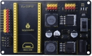          |              Keyestudio ESP32 servo drive board              |  1   |
|  2   |         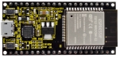          |                 keyestudio ESP32 Core board                  |  1   |
|  3   |         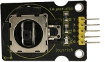          |                  Keyestudio Joystick Module                  |  2   |
|  4   |         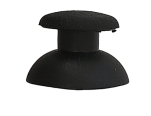          |                     3D PS2 joystick cap                      |  2   |
|  5   |         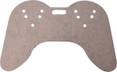          |                     Acrylic handle T=3MM                     |  1   |
|  6   |         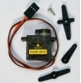          |                  MG90S 14G 180° metal servo                  |  3   |
|  7   |         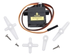          |                 9G 180° servo for robot claw                 |  1   |
|  8   |         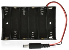          |          DC 6-slot AA battery holder 15CM connector          |  1   |
|  9   | 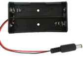 | 2 18650 battery packs <br />(recommended to use pointed 18650 batteries) |  1   |
|  10  |        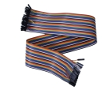         |                   F-F 50CM/10P DuPont wire                   |  1   |
|  11  |        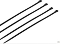         |                      cable tie 3*100MM                       |  7   |
|  12  |        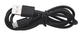         |                       Micro USB cable                        |  1   |
|  13  |        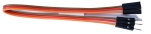         | 3 pin M-F 20CM DuPont wire (used to extend the wire of the clip) |  1   |
|  14  |        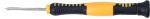         |                 3*40MM Phillips screwdriver                  |  1   |
|  15  |                 |                         M2+M3 wrench                         |  1   |
|  16  |        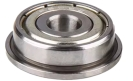         | F693ZZ motor class<br />Inner: 3MM; Outer: 8MM; Thickness: 4MM |  3   |
|  17  |        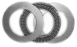         | AXK 3-plate flat bearing<br />Inner: 20MM; Outer: 35MM, Thickness: 4MM |  1   |
|  18  |        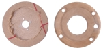         | 2 bearing covers(You need to tear off the brown protective film) |  1   |
|  19  |        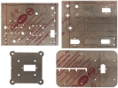         |                       4 acrylic board                        |  1   |
|  20  |        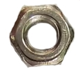         |                            M3 nut                            |  14  |
|  21  |        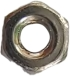         |                            M2 nut                            |  4   |
|  22  |        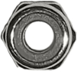         |                     M3 self-locking nut                      |  8   |
|  23  |        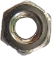         |                           M2.5 nut                           |  8   |
|  24  |        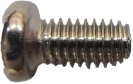         |                   M3*6MM round head screw                    |  4   |
|  25  |        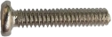         |                   M2*10MM round head screw                   |  4   |
|  26  |        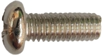         |                   M3*8MM round head screw                    |  4   |
|  27  |        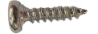         |              M1.2*5MM self-tapping screw 2.54MM              |  2   |
|  28  |        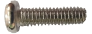         |                   M3*10MM round head screw                   |  3   |
|  29  |        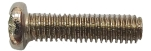         |                   M3*12MM round head screw                   |  5   |
|  30  |        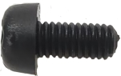         |                M3*6MM round head nylon screw                 |  8   |
|  31  |        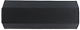         |                M3*16mm dual-pass nylon pillar                |  2   |
|  32  |                 |                M3*22mm dual-pass nylon pillar                |  2   |
|  33  |        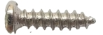         |                  M2*8MM self-tapping screw                   |  4   |
|  34  |        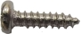         |              M1.2*4MM self-tapping screw 2.54MM              |  4   |
|  35  |        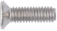         |                    M3*8MM flat head screw                    |  2   |
|  36  |        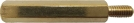         |            M2.5*25+6MM single-pass copper pillar             |  8   |
|  37  |        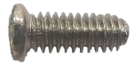         |                  M2.5*6MM round head screw                   |  8   |
|  38  |                 | M1.4x6MM self-tapping screw or<br />M1.4x8MM self-tapping screw |  4   |
|  39  |        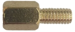         |              M3*6+6MM single-pass copper pillar              |  6   |
|  40  |        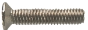         |                   M3*14MM flat head screw                    |  2   |


## 2. Description

Based on ESP32 control board, we designed a complete kit that includes the required hardware and tools for you to build up a programmable robot arm. In the tutorials we provide, you can control it with a joystick, you can also control it using a mobile phone or a computer connected to the same wifi as our ESP32 board. It can reach out, grab, pick up and move small objects, and it has a memory function to repeat the actions you set.

This is an ideal maker project for beginners to learn the ESP32 board and servo. 


## 3. Parameters

Operating voltage: 3.3~5V

DC input voltage: 7~12V

Battery holder: 6-slot AA battery holder  / 2-slot 18650 battery holder (Batteries not included)

DOF: 4 degree of freedom


## 4. Features

**Flexibility**: With 4 degrees of freedom, the robot arm is able to move and rotate in multiple directions to perform complex actions and tasks.

**Convenient Control**: The ESP32 microcontroller is used as the control core, and its rich interface are convenient for communication and control with other devices or systems.

**Programming Flexibility**: Automatic operations can be realized via programming, such as planning motion trajectory, grasping and placing objects.

**Openness and Expandability**: The ESP32 platform contains an open ecosystem to be customizes and extended according to needs. You can add sensors and actuators to fit for multiply application.


## 5. KEYESTUDIO ESP32 Main Board

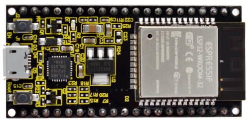

### 5.1 Introduction

Based on ESP-WROOM-32, the keyestudio ESP32 Core board is a mini development board, whose I/O pins are reserved a space of 2.54mm on both sides, so that it can be connected to peripherals according to needs. In addition, these pins also make your operation more concise and convenient when  using and debugging.

The ESP-WROOM-32 module adopts industry's leading WiFi + Bluetooth solution. Its external components is fewer than 10, including an antenna switch, RF balun, power amplifier, low noise amplifier, filter and power management module. It also integrates TSMC low-power 40nm technology, featuring high power performance and RF performance. Besides, it is safe, reliable, and easy to expand to various applications.

### 5.2 Parameters

Microcontroller: ESP-WROOM-32 module

USB-to-serial chip: CP2102-GMR

Operating voltage: DC 5V

Operating current: 80mA (average)

Supply current: 500mA (minimum)

Operating voltage: -40°C ~ +85°C 

WiFi mode: Station/SoftAP/SoftAP+Station/P2P

WiFi protocol: 802.11 b/g/n/e/i (802.11n, speed up to 150 Mbps)

WiFi frequency range: 2.4 GHz ~ 2.5 GHz

Bluetooth Protocol: BT v4.2 BR/EDR and BLE standard

Dimensions: 55x26x13mm

Weight: 9.3g

### 5.3 Pin-out

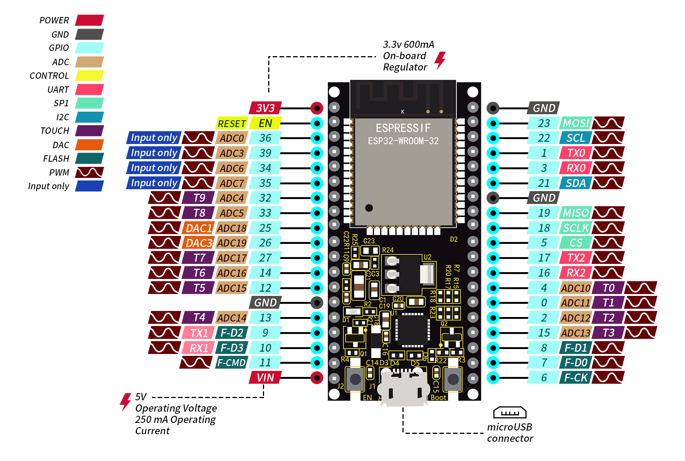

Although ESP32 board boasts fewer pins than commonly used processors, you will not encounter any problems when you reuse multiple functions on pins (pins IO36, IO35, IO34, IO39 only inputs signals).

**ATTENTION**: The voltage of ESP32 pins is 3.3V. If it works with other devices with an operating voltage of 5V, a level converter is required.

● **Power**: 2 power supply pins +5V and 3.3V, used to power other devices and modules.

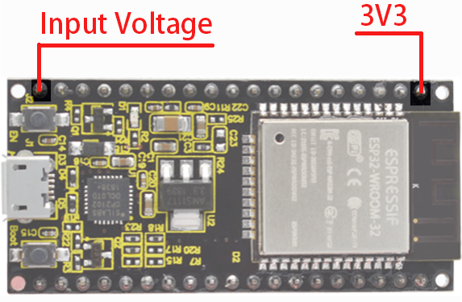

● **GND**: 3 GND pins.

● **Enable pin(EN)**: used to enable or disable modules. The pin enables module at high and disables at low.

● **I/O pin(GPIO)**: 32 GPIO pins, used to communicate with LED, switches, and other input/output devices. These pins can be pulled up or down.

**NOTE: GPIO6 - GPIO11(SCK/CLK, SDO/SD0, SDI/SD1, SHD/SD2,S WP/SD3, SCS/CMD) are used for SPI communication of flash memory inside the module, which are not recommend.**

● **ADC**: 16 ADC pins, used to convert analog voltage(some sensor outputs) to digital voltage. Some of these converters are connected to internal amplifiers so are able to measure small voltages with high accuracy.

● **DAC**: 2 digital-to-analog converters with 8-bit accuracy. 

● **Touch pad**: 10 pins that are sensitive to capacitance changes. Touch buttons can be built by connecting these pins to certain pads (pads on the PCB).

● **SPI**: 2 SPI interfaces, used to connect to displays, SD / microSD card, external flash memory, etc.

● **I2C**: Pins SDA and SCL are used for I2C communication.

● **Serial Communication (UART)**: 2 UART serial ports, used to transmit data up to 5Mbps between devices. UART0 also boasts CTS and RTS control function.

● **PWM**: all I/O pins can be used for PWM(pulse width modulation) to control motors, LED brightness and colors, and so on.

### 5.4 Main Parts

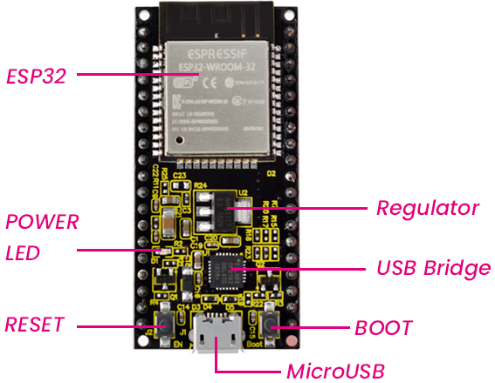

## 6. ESP32 Servo Drive Board

### 6.1 Description

The KEYESTUDIO ESP32 servo drive board has 6 servo drive ports (5V), 9 IO ports (3.3V), and two IIC interfaces (3.3V). The servo drive uses two LM2596S-5.0V 3A high current power ICs to provide working voltage to the servo. Then, 1117 3.3V supplies power to 9 IO ports and IIC ports.

### 6.2 Parameters

External power: 7-12V

Servo pin voltage: 5V

IO port voltage: 3.3V

Dimensions: 90 x 55 x 15.5mm

Weight: 41g (bare board)

### 6.3 Pin-out


### 6.4 Schematic Diagram

[Schematic Diagram.PDF](./schematic_diagram.pdf)


## 7. Configure Arduino IDE

### 7.1 Download and install Arduino IDE

You could download the latest Arduino IDE from the official website: https://www.arduino.cc/en/software

There are versions for Windows, Mac, and Linux systems. 

Here we will choose the Windows version to show you how to download, install and use it. You can choose between the Installer (.exe) and the Zip packages. We suggest you use the first one that installs directly everything you need to use the Arduino Software (IDE), including the drivers. With the Zip package you need to install the drivers manually. The Zip file is also useful if you want to create a portable installation.

- Select Win 10 and newer, 64 bits in DOWNLOAD OPTIONS.

  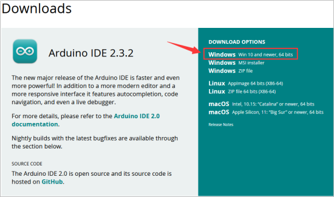

- Click JUST DOWNLOAD

  

- Join Newsletter or you can just Click JUST DOWNLOAD

  


- Save the .exe file downloaded from the software page to your hard drive and simply run the file .

  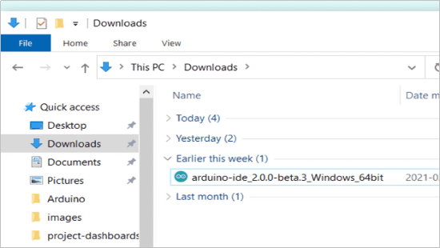

- Read the License Agreement and agree it.

  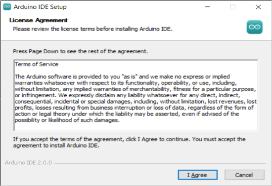

- Choose the installation options.

  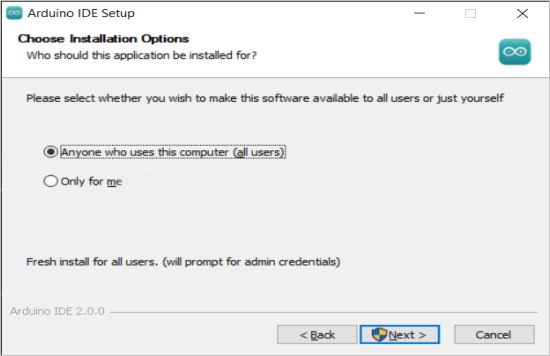

- Choose the install location.

  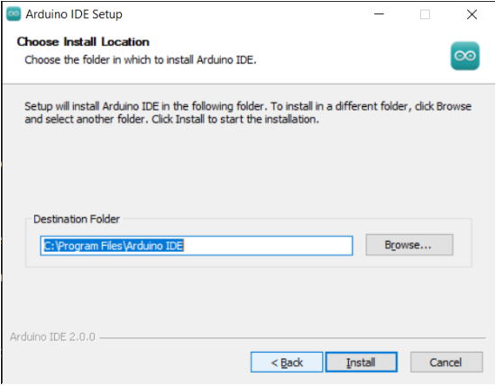

- In addition, the security center may pop up a few times asking you if you want to install some device driver. Please install all of them.

  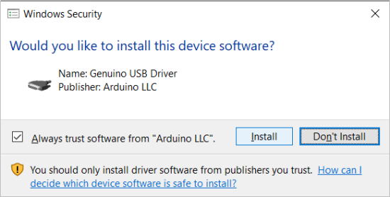

- Click finish and run Arduino IDE

  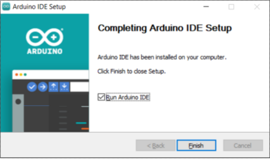

- Firewall will ask whether we'd like to give allow access, just simply click on Allow access.

  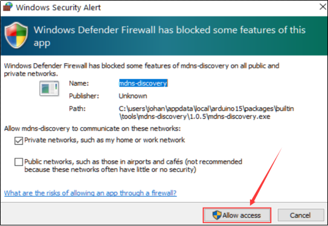

- Firewall will ask whether we'd like to give allow access, just simply click on Allow access.

- Wait for some time to allow arduino IDE to automatically install the Arduino AVR Boards, built-in libraries, and other required files.

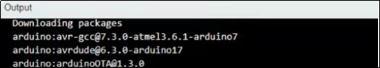

---

### 7.2 Introduce of Arduino IDE 2.0


**Verify / Upload** - compile and upload your code to your Arduino Board.

**Select Board & Port** - detected Arduino boards automatically show up here, along with the port number.

**Sketchbook** - here you will find all of your sketches locally stored on your computer. Additionally, you can sync with the Arduino Cloud, and also obtain your sketches from the online environment.

**Boards Manager** - browse through Arduino & third party packages that can be installed. For example, using a MKR WiFi 1010 board requires the Arduino SAMD Boards package installed.

**Library Manager** - browse through thousands of Arduino libraries, made by Arduino & its community.

**Debugger** - test and debug programs in real time.

**Search** - search for keywords in your code.

**Open Serial Monitor** - opens the Serial Monitor tool, as a new tab in the console.

If you want to learn more about Arduino IDE, please refer to this document：[**Getting Started with Arduino IDE 2**](https://docs.arduino.cc/software/ide-v2/tutorials/getting-started-ide-v2/)

---

### 7.3 Install Driver for ESP32 board

The USB-to-serial chip of the ESP32 board is CP2102-GMR.

Connect the ESP32 board to the computer with the usb cable and wait for Windows to begin its driver installation process. Often CP2102 drivers will be automatically installed by your system when using Arduino. You can check the Device Manager or the port of the Arduino IDE to see if the driver is successfully installed.

Open the **Device Manager** by right clicking **“My computer” **and selecting **control panel**.

Look under **Ports (COM & LPT)**. You should see an open port named **Silicon Labs CP210x USB to UART Bridge (COM-X)**

Click **Tools>Port** at Arduino IDE, you can find the com port displayed by device manager


If **the installation process fail**, you should see a device with a tiny yellow triangle and exclamation mark next to it.


**Now let's install CP210x Chip driver manually.**

1. In the tutorial package we downloaded(https://fs.keyestudio.com/FKS0003), you can find the CP210x_6.7.4 driver file.

  

2. Right click on the **"CP210x USB to UART Bridge Controller"** and choose the **"Update Driver Software"** option.

  

3. Choose the **"Browse my computer for Driver software"** option.

  

4. Select the driver file named **"CP210x_6.7.4"**, located in the tutorial package we downloaded.

  

5. After a while, the driver is installed successfully.

  

---

### 7.4 Configure the ESP32 environment in Arduino


<p style="color:red;">NOTE: ESP32 environment in Arduino **2.0.12** is recommended, since our tutorials are based on this version. Incompatibilities may exist if other versions are choosed.</p>

---

For Windows, there is an easier way to install the ESP32 environment. 
Double click the downloaded program `esp32_package_2.0.12_arduinome.exe` in the tutorial package to enable the automatic installation. 


Wait for its installation process to complete


You can also find the download link to the `esp32_package_2.0.12_arduinome.exe` : [https://fs.keyestudio.com/ESP32](https://fs.keyestudio.com/ESP32)

After the installation is complete, type ESP32 in the BOARDS MANAGER of the Arduino IDE, you will see the the ESP32 environment in Arduino: 2.0.12 (ESP32 by Espressif Systems)


---

### 7.5 Adjust the servo to 90° before assembly
We need to adjust all the servos to 90° before assembly so that the robotic arm will work as preset. Otherwise, the robot will not work and the servos may be burned out.

1. Prepare four servos, an EPS32 board, an ESP32 shield, and a USB cable.

| #    | PIC                      | NAME                               | QTY  |
| ---- | ------------------------ | ---------------------------------- | ---- |
| 1    |  | Keyestudio ESP32 servo drive board | 1    |
| 2    |  | keyestudio ESP32 Core board        | 1    |
| 3    |  | MG90S 14G 180° metal servo         | 3    |
| 4    |  | 9G 180° servo for robot claw       | 1    |
| 5    |  | Micro USB cable                    | 1    |

2. Wiring:

| Servo drive board |   Servo   |
| :---------------: | :-------: |
|   IO17(yellow)    | S(yellow) |
|      5V(red)      |  V(red)   |
|    GND(black)     | G(brown)  |

<p style="font-size:18px;color:red;">Pay attention to the installation direction of the EPS32 board. Installing it in reverse may burn it.</p>


3. Connect the ESP32 board to the computer with the USB cable.
   Select board type **"ESP32 Dev Module"**


4. Select port COM-4 (This depends on the number your computer assigns to the ESP32 board, which you can check in the device manager).


5. Before uploading code, please import “ESP32Servo” library to Arduino IDE to avoid compiling failure.

 <p style="color:red">The library file version must be 1.2.1, otherwise an error will also be reported. How to import "ESP32Servo" library:</p>

- [ ] Click the **LIBRARY MANAGER** button in the upper left corner of the Arduino IDE. 

- [ ] Enter **"ESP32servo"** in the search box.

- [ ] Choose the 1.2.1 version of the **"ESP32servo"** library.

- [ ] Click to **INTALL** it.

  

6. Open the code named ***\*Adjust_the_servo_to_90_degrees\**** using the Arduino IDE and upload it. 


Or directly copy the code below into the Arduino IDE and click upload.

```c
/*
  Keyestudio ESP32 Robot Arm
  7-5 Servo Configuration
  Function: set servo at pin IO17 to the angle of 90°
  http://www.keyestudio.com
*/
#include <ESP32Servo.h>

// create a servo objects ，Customizable name
Servo servo;
int servoPin = 17; //Connect servo to pin IO17

void setup()
{ 
  servo.attach(servoPin);  
  servo.write(0);  //Set servo angle to 0°
  delay(1000);
  servo.write(180);  //Set servo angle to 180°
  delay(1000);   
  servo.write(90);  //Set servo angle to 90°
}

void loop() {
}
```

After uploading the code, the servo will initialize to 0° first. Then it rotates from 0 to 180° and then it maintains at 90°. We need to ensure the servo is at 90° position before installing.

Operate all servos in this way to adjust the angle of the servos to 90°


