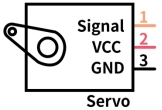
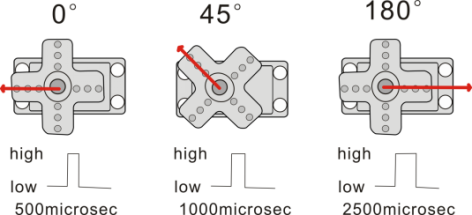
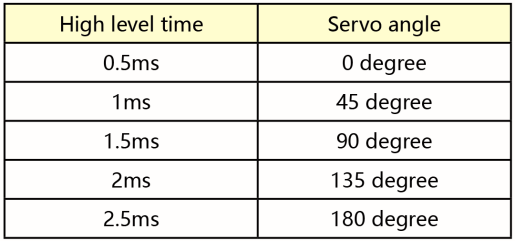
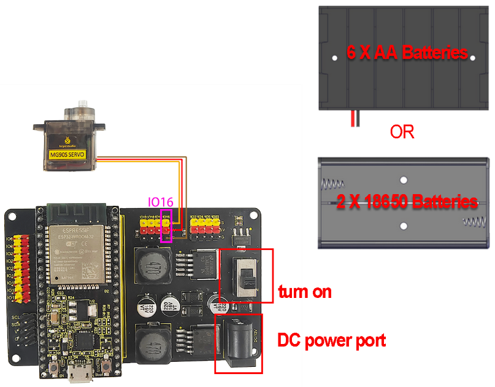
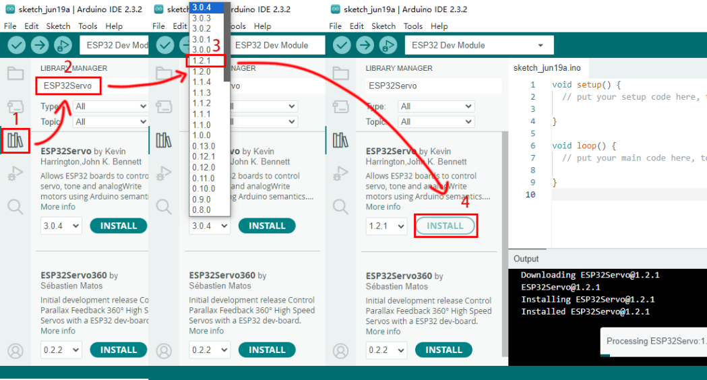
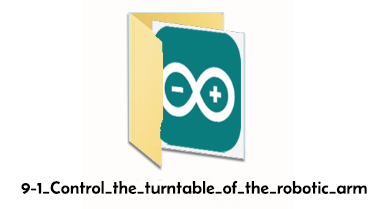
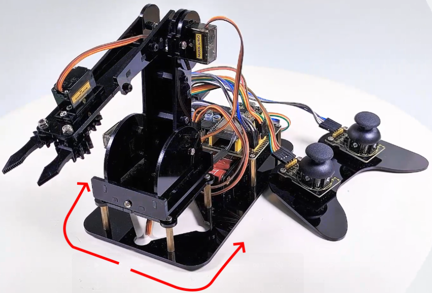

### 9.1 Control the turntable of the robotic arm


#### **9.1.1 Introduction**

Servo is a position driver, which is mainly composed of a shell, a circuit board, a non-core motor, a gear and a position detector. When a receiver or an MCU sends a signal to the steering gear, its built-in reference circuit generates a reference signal with a period of 20ms and a width of 1.5ms. The obtained DC bias voltage will be compared with the voltage of the potentiometer to output a voltage difference.

There are many specifications of the servo, and generally most of them conclude three external wires in brown(grounded), red(power positive), orange(signal), Yet the colors may vary from brands. 




#### **9.1.2 Parameters**

Operating voltage: DC 4.8V 〜 6V

Dimensions: 32.2 x 12 x 33.3mm   

Torque: 2.0kg (4.8v)    

Speed: 0.11s (4.8v)   

Rotation angle: Maximum 180°

Pulse width range: 500→2500 μsec

Servo type: Analog servo       

Operating temperature: 0°-55°      

Dead-time: 5 microseconds

Structure material: metal copper gear, hollow cup motor, double ball bearing

#### **9.1.3 Principle**

The rotation angle of the servo can be controlled by adjusting the duty cycle of the PWM (pulse width modulation) signal. 

The period of the standard PWM (pulse width modulation) signal is fixed at 20ms (50Hz). Theoretically,  pulse width should be within 1ms ~ 2ms, but in fact, the range is 0.5ms ~ 2.5ms, corresponding to the rotation angle of 0° to 180°.




Corresponding servo Angle value:




#### **9.1.4 Wiring Diagram**


In the previous assembly steps, we connected the **servo where the turntable is located** to the IO16.
<p style="color:red;">External power supply is required, because the current of the development board is far from meeting the relatively large current requirements for driving the servo.</p>




#### **9.1.5 Upload Code**

Before uploading code, please import “ESP32Servo” library to Arduino IDE to avoid compiling failure. 

<p style="color:red">The library file version must be 1.2.1, otherwise an error will also be reported. How to import "ESP32Servo" library:</p>


- [ ] Click the **LIBRARY MANAGER** button in the upper left corner of the Arduino IDE. 
- [ ] Enter **"ESP32servo"** in the search box.
- [ ] Choose the 1.2.1 version of the **"ESP32servo"** library.
- [ ] Click to **INTALL** it.


Use the Arduino IDE to open this code directly from the tutorial package.

Connect the ESP32 board to the computer with the USB cable.
Select board type "ESP32 Dev Module" and select port COM-XX (This depends on the number your computer assigns to the ESP32 board, which you can check it in the device manager).



Or you can copy and paste the code from below into the Arduino IDE.

```c
/*
  Keyestudio ESP32 Robot Arm
  9-1 tutorial code
  Function: control the servo to rotate to 0°, 90°, 180°
  http://www.keyestudio.com
*/
#include <ESP32Servo.h>

// create a servo objects ，Customizable name
Servo servo;
int servoPin = 16; //Connect servo to pin IO16

void setup()
{ 
  servo.attach(servoPin);   
}

void loop() {
    servo.write(0);  //Set servo angle to 0°
    delay(1000);	//Delay 1s
    servo.write(90);  //Set servo angle to 90°
    delay(1000);
    servo.write(180);  //Set servo angle to 180°
    delay(1000);
}
```

9.1.6 Test Result

After uploading the code, the servo rotates from 0° to 90° and delays for 1s, and then rotates to 180° and also delays for 1s. At last, it back to 0° to repeat these actions. **We're going to see the robot arm turn from side to side.**




