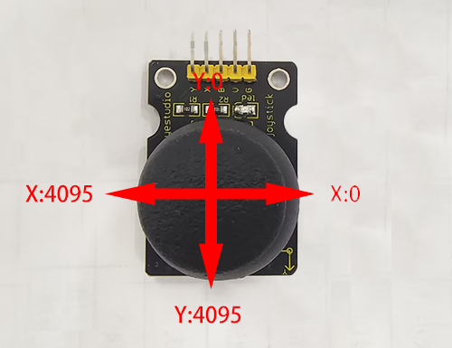
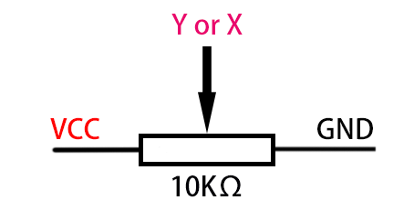
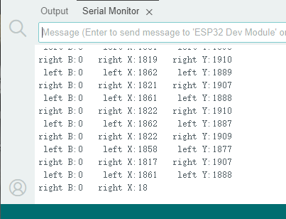

### 9.2 Read Analog Value of Joystick

#### 9.2.1 Introduction

The joystick module adopts a PS2 handle rocker. When controlling, we connect the X and Y ports to the analog port of the MCU, port B to the digital port, VCC to the power output(3.3-5V), and GND to the GND. We can read the power level of the digital port and two analog values to know the state of the joystick module.

#### 9.2.2 Parameters

Operating voltage: 3.3V ~ 5V

Three axes: X, Y, Z

Dimensions: 44.2 x 28 x 32.8mm

#### 9.2.3 Principle

Axis X and Y are actually two potentiometers. 

As shown below, the analog value of the X(Y) axis ranges from 0 ~ 4095 (the analog value of ESP32 is 0 ~ 4095).



The analog value will decrease in the Y-axis upward because the resistance of the output pin to the ground is decreasing, and the resistance will be increasing in the downward direction. So does it in the X-axis (direction: right and left).




#### 9.2.4 Read the values of the two joysticks and print them on the serial monitor.

Before uploading code, please import “ESP32Servo” library to Arduino IDE to avoid compiling failure. 

<p style="color:red">The library file version must be 1.2.1, otherwise an error will also be reported. How to import "ESP32Servo" library:</p>

Use the Arduino IDE to open this code directly from the tutorial package.

Connect the ESP32 board to the computer with the USB cable.
Select board type "ESP32 Dev Module" and select port COM-XX (This depends on the number your computer assigns to the ESP32 board, which you can check it in the device manager).


Or copy the code below into the Arduino IDE and click upload.

```c
/*
  Keyestudio ESP32 Robot Arm
  9-2 tutorial code
  Function: 
  http://www.keyestudio.com
*/
//Define the left remote rod pin
#define left_B 12  
#define left_X 13
#define left_Y 15
//Define the right remote rod pin
#define right_B 25
#define right_X 33
#define right_Y 32
//Define variables for storing remote sensing values
int left_B_data, left_Y_data, left_X_data, right_B_data, right_X_data, right_Y_data;  

void setup() {
  // put your setup code here, to run once:
  Serial.begin(9600);
  pinMode(left_B, INPUT);   //Set pins to input mode
  pinMode(left_X, INPUT);
  pinMode(left_Y, INPUT);
  pinMode(right_B, INPUT);
  pinMode(right_X, INPUT);
  pinMode(right_Y, INPUT);
}
void loop() {
  // put your main code here, to run repeatedly:
  left_B_data = digitalRead(left_B);    
  left_X_data = analogRead(left_X);
  left_Y_data = analogRead(left_Y);

  right_B_data = digitalRead(right_B);
  right_X_data = analogRead(right_X);
  right_Y_data = analogRead(right_Y);

  Serial.print(" left B:");
  Serial.print(left_B_data);
  Serial.print("    left X:");
  Serial.print(left_X_data);
  Serial.print("    left Y:");
  Serial.println(left_Y_data);
  
  Serial.print("right B:");
  Serial.print(right_B_data);
  Serial.print("   right X:");
  Serial.print(right_X_data);
  Serial.print("   right Y:");
  Serial.println(right_Y_data);
  delay(300);
}

```


Result

After uploading the code, open the **serial port monitor** and set the serial port baud rate to **9600**, you will see the printed remote control value on it. If you feel that the serial port printing speed is too fast, you can increase the value in the parentheses of the delay ().



