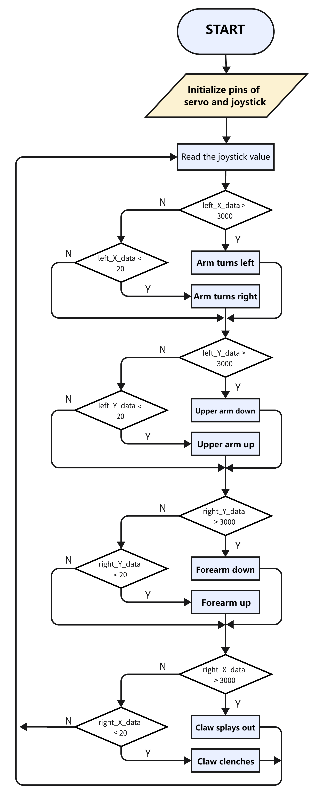
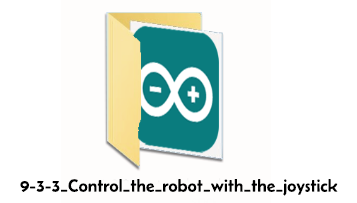
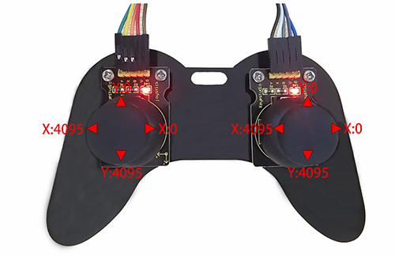
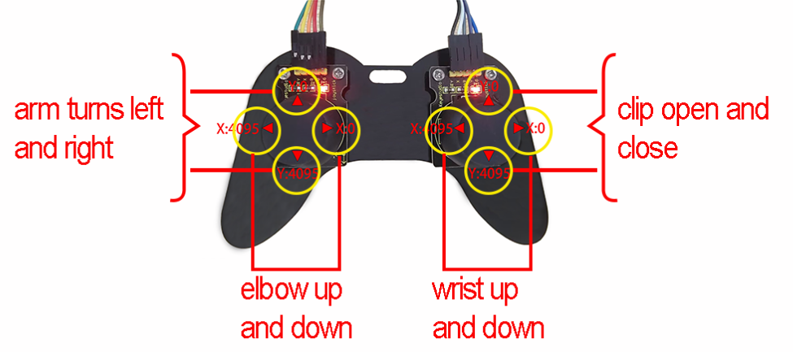

### 9.3 Joystick Control Robot Arm

#### 9.3.1 Introduction

We connect the ESP32 development board and the joystick module to the servo drive board, and then the development board reads the value of the axis X/Y of the module to determine the rotation angle, so that the arm is controlled by the module.

#### 9.3.2 Flow



#### 9.3.3 Control the robot with the joystick.

Use the Arduino IDE to open this code directly from the tutorial package.




Or you can copy and paste the code from below into the Arduino IDE.

```c
/*
  Keyestudio ESP32 Robot Arm
  9-3-3 tutorial code
  Function: joystick control the robot arm
  http://www.keyestudio.com
*/
#include "ESP32Servo.h"
Servo base;  // create servo object to control a servo
Servo arm;
Servo forearm;
Servo gripper;
//set servo control pins
#define basePin 16
#define armPin 17
#define forearmPin 2
#define gripperPin 4
//set left joystick pins
#define left_B 12
#define left_X 13
#define left_Y 15
//set right joystick pins
#define right_B 25
#define right_X 33
#define right_Y 32
int left_B_data, left_Y_data, left_X_data, right_B_data, right_X_data, right_Y_data;
//servo
int baseAngle = 90;     // Initialize bottom servo angle
int armAngle = 90;       // Initialize upper arm servo angle
int forearmAngle = 90;  // Initialize forearm servo angle
int gripperAngle = 90;  // Initialize claw servo angle

void setup() {
  // put your setup code here, to run once:
  Serial.begin(9600);
  pinMode(left_B, INPUT);
  pinMode(left_X, INPUT);
  pinMode(left_Y, INPUT);
  pinMode(right_B, INPUT);
  pinMode(right_X, INPUT);
  pinMode(right_Y, INPUT);

  base.attach(basePin);  // attaches the servo on pin 16 to the servo object
  arm.attach(armPin);
  forearm.attach(forearmPin);
  gripper.attach(gripperPin);

  base.write(baseAngle);
  arm.write(armAngle);
  forearm.write(forearmAngle);
  gripper.write(gripperAngle);
}

void loop() {
  // put your main code here, to run repeatedly:
  left_B_data = digitalRead(left_B);
  left_X_data = analogRead(left_X);
  left_Y_data = analogRead(left_Y);

  right_B_data = digitalRead(right_B);
  right_X_data = analogRead(right_X);
  right_Y_data = analogRead(right_Y);

  baseControl();
  armControl();
  forearmControl();
  gripperControl();
}

//control base
void baseControl() {
  if (left_X_data > 3000) {
    while (analogRead(left_X) > 3000) {
      base.write(baseAngle++);
      if (baseAngle >= 180) baseAngle = 180;
      delay(10);
    }
  } else if (left_X_data < 20) {
    while (analogRead(left_X) < 20) {
      base.write(baseAngle--);
      if (baseAngle <= 0) baseAngle = 0;
      delay(10);
    }
  }
}

//control upper arm
void armControl() {
  if (left_Y_data > 3000) {
    while (analogRead(left_Y) > 3000) {
      arm.write(armAngle++);
      if (armAngle >= 180) armAngle = 180;
      delay(10);
    }
  } else if (left_Y_data < 20) {
    while (analogRead(left_Y) < 20) {
      arm.write(armAngle--);
      if (armAngle <= 80) armAngle = 80;
      delay(10);
    }
  }
}

//control forearm
void forearmControl() {
  if (right_Y_data < 20) {           
    while (analogRead(right_Y) < 20) {
      forearm.write(forearmAngle++);
      if (forearmAngle >= 120) forearmAngle = 120;
      delay(10);
    }
  } else if (right_Y_data > 3000) {
    while (analogRead(right_Y) > 3000) {
      forearm.write(forearmAngle--);
      if (forearmAngle <= 30) forearmAngle = 30;
      delay(10);
    }
  }
}

//control claw
void gripperControl() {
  if (right_X_data > 3000) {
    while (analogRead(right_X) > 3000) {
      gripper.write(gripperAngle++);
      if (gripperAngle >= 150) gripperAngle = 150;
      delay(10);
      // gripper.write(180);
    }
  } else if (right_X_data < 20) {
    while (analogRead(right_X) < 20) {
      // gripper.write(80);
      gripper.write(gripperAngle--);
      if (gripperAngle <= 90) gripperAngle = 90;
      delay(10);
    }
  }
}

```

#### 9.3.4 Test Result

After uploading the code, rotate joysticks to control the arm.

For the left joystick, axis X controls the entire rotation of the robot arm (X < 20: turn right; X > 3000: turn left); its axis Y raises and lowers the upper arm (Y < 20: up; Y > 3000: down).

For the right joystick, axis X controls the claw (X < 20: splay; X > 3000: clench); axis Y raises and lowers the forearm (Y < 20: up; Y > 3000: down).

Push up the joystick module to raise up axis Y, so its value decreases, and push down to increase the value of axis Y. The working principle of the upper arm and the forearm are alike.





