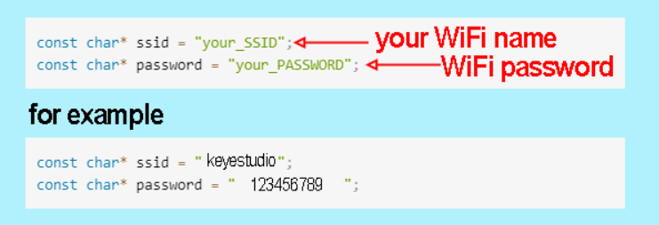
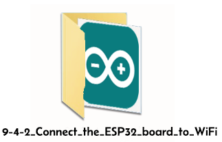
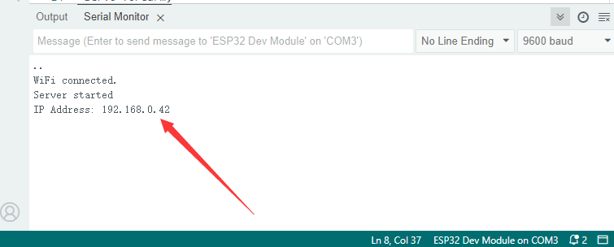
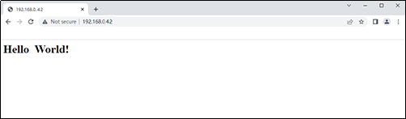
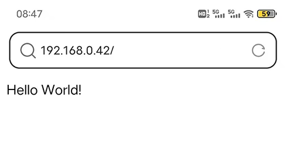
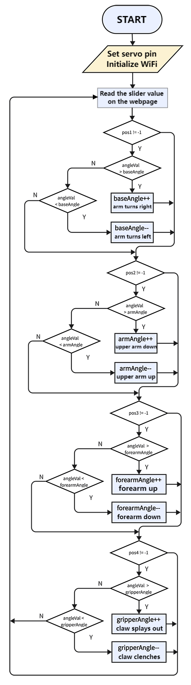
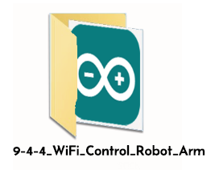
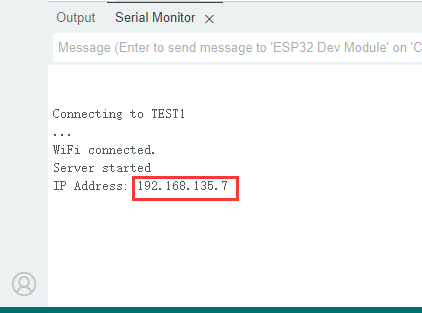
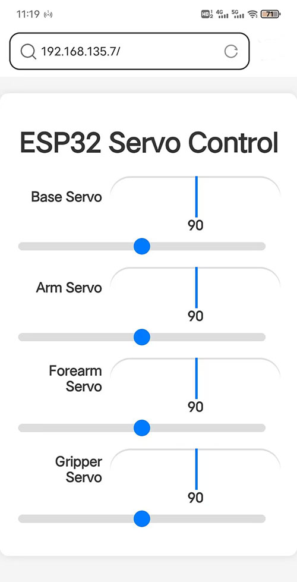
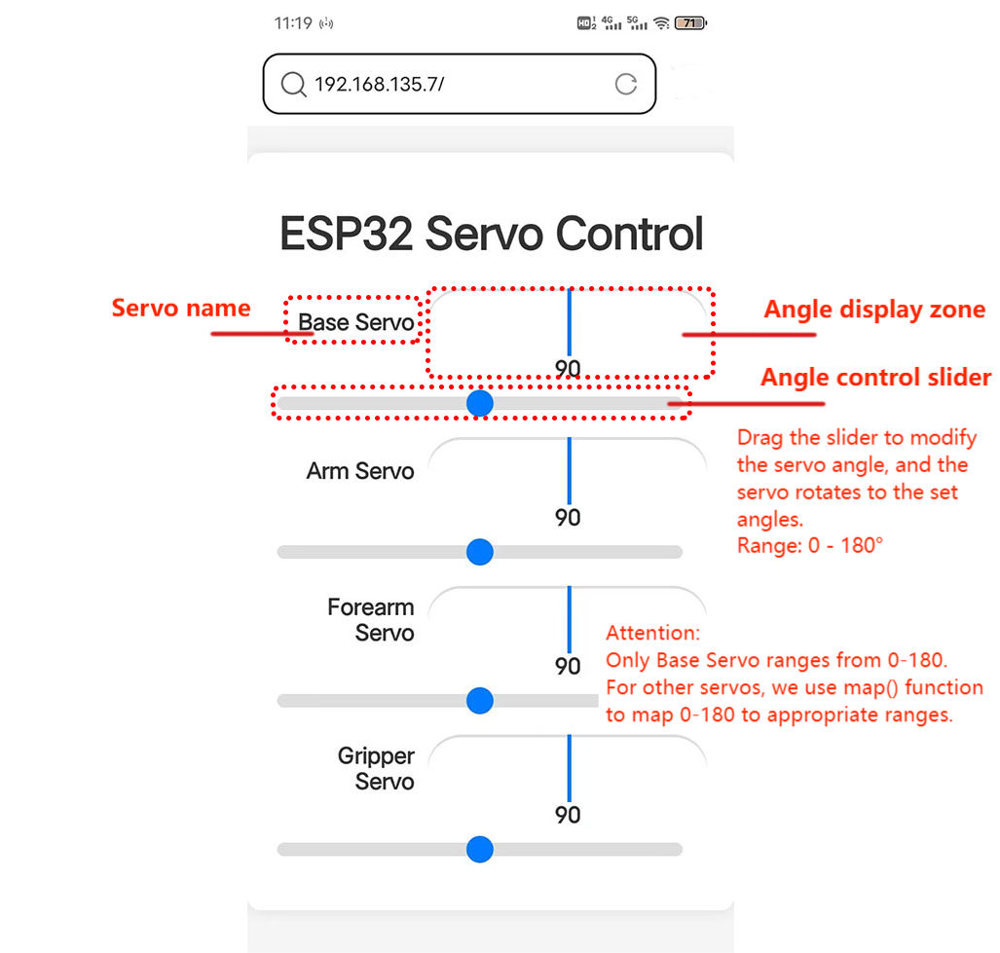

### 9.4 WiFi Control Robot Arm

#### 9.4.1 Introduction


In this experiment, we will control the arm through WiFi. 

**You need to prepare:**
- a **2.4 GHz WiFi**. It can be a mobile hotspot or a router.
- a phone/IPAD/computer that can connect to the same internet.
- The network name and password of your wifi.

NOTE: 

In the all codes we provided for ESP32 control, you need to change the word **your_SSID** in the code to your WiFi name and **your_PASSWORD** in the code to your WiFi password before uploading.



#### 9.4.2 Connect the ESP32 board to WiFi

ESP32 Development Board comes with built-in Wi-Fi (2.4G) and Bluetooth (4.2) capabilities to easily connect to a Wi-Fi network and communicate with other devices in the network. You can use ESP32 to build web pages and display them in a browser.


**Arduino IDE includes a library \<WiFi.h\>, which configures and monitors ESP32 Wi-Fi networking.**

- Station Mode (STA mode / Wi-Fi client mode): ESP32 connects to a Wi-Fi hotspot (AP).
- AP Mode (Soft-AP mode / Wi-Fi hotspot mode): Other Wi-Fi devices connects to the ESP32.
- AP-STA Mode (ESP32 is both a Wi-Fi hotspot and a Wi-Fi device connecting to another Wi-Fi).
- Support multiple security modes: WPA, WPA2, WEP, etc.
- Support Wi-Fi searching: Active/passive scanning
- Support hybrid mode monitoring of IEEE802.11 Wi-Fi packets.

------

For more wifi reference, please visit: [https://docs.espressif.com/projects/esp-idf/en/latest/esp32/api-reference/network/esp_wifi.html](https://docs.espressif.com/projects/esp-idf/en/latest/esp32/api-reference/network/esp_wifi.html)

espressif official: [https://www.espressif.com.cn/en/home](https://www.espressif.com.cn/en/home)


**Connect the ESP32 board to WiFi:**

First we need to upload code to the ESP32 board to ensure the ESP32 correctly connects to Wifi. 

Use the Arduino IDE to open this code directly from the tutorial package.

Connect the ESP32 board to the computer with the USB cable.
Select board type "ESP32 Dev Module" and select port COM-XX (This depends on the number your computer assigns to the ESP32 board, which you can check it in the device manager).



Or you can copy and paste the code from below into the Arduino IDE.

```c++
/*
  Keyestudio ESP32 Robot Arm
 9-4-2 tutorial code
  Function: connect to wifi and print ESP32 IP address on the serial monitor
  http://www.keyestudio.com
*/
#include <WiFi.h>
// #include <WebServer.h>
/*ATTENTION:
  ESP32 only supports wifi at a frequency of 2.4GHz.
  If wifi fails to be connected, please check wifi name, passwords and frequency.
  Modify "your_SSID " into your wifi name
  Modify "your_PASSWORD" into your wifi passwords*/

 const char* ssid = "your_SSID";
 const char* password = "your_PASSWORD";

void setup() {
  Serial.begin(9600);
  //initialize Wifi
  WiFi.begin(ssid, password);
  //search wifi. while loop: if no wifi is connected, keep searching; state: connecting
  while (WiFi.status() != WL_CONNECTED) {
    delay(500);
    Serial.print(".");
  }
  Serial.println("");
  Serial.println("WiFi connected.");

  //wifi connected: print the IP address
  Serial.println("Connected to WiFi");
  Serial.println(WiFi.localIP());
}

void loop() {
}
```

In this code, please modify `your_ssid` and `your_password` into your Wi-Fi name and passwords respectively.

```c++
const char* ssid = "your_SSID";
const char* password = "your_PASSWORD";
```

After uploading the code, open the serial monitor you will see it prints the connecting state and IP address of your WIFI.



------

#### 9.4.3 Visit the IP Web Page


In this step, once esp32 board connect to the wifi, the ESP32's Web server will serve up web pages. In the following example, we will create a simple web page that says "Hello, World!". You can use the phone/IPAD/computer that connected to the same internet as ESP32 board to visit this web page.

Use the Arduino IDE to open this code directly from the tutorial package.

Connect the ESP32 board to the computer with the USB cable.
Select board type "ESP32 Dev Module" and select port COM-XX (This depends on the number your computer assigns to the ESP32 board, which you can check it in the device manager).


Or you can copy and paste the code from below into the Arduino IDE.


```c++
/*
  Keyestudio ESP32 Robot Arm
  9-4-3 tutorial code
  Function: Conenct to WiFi and print esp32 IP address, set up a web page saying “Hello World！”
  http://www.keyestudio.com
*/
#include <WiFi.h>
#include <WebServer.h>

/*ATTENTION:
  ESP32 only supports wifi at a frequency of 2.4GHz.
  If wifi fails to be connected, please check wifi name, passwords and frequency.
  Modify "your_SSID " into your wifi name
  Modify "your_PASSWORD" into your wifi passwords*/

 const char* ssid = "your_SSID";
 const char* password = "your_PASSWORD";

WiFiServer server(80);  //Set the web port to 80. You can directly enter the IP address to access the web page without entering the port number.

void setup() {
  Serial.begin(9600);
  // Connect to WiFi network
  Serial.println();
  Serial.println();
  Serial.print("Connecting to ");
  Serial.println(ssid);
  WiFi.begin(ssid, password);
  while (WiFi.status() != WL_CONNECTED) {
    delay(500);
    Serial.print(".");
  }
  Serial.println("");
  Serial.println("WiFi connected.");
  // Start the server
  server.begin();
  Serial.println("Server started");
  // Print the IP address
  Serial.print("IP Address: ");
  Serial.println(WiFi.localIP());
}

void loop() {
  WiFiClient client = server.available();  //Try to accept a request coming in from the WiFi server and assign it to a WiFiClient object named client
  if (!client) {                           //This conditional statement checks whether the connection from the client was successfully accepted. If not, exit execution immediately
    return;
  }
  Serial.println("New client");
  while (!client.available()) {           //The loop will wait until the client has sent the request and the data is available. While waiting, the code is delayed at 1 millisecond intervals
    delay(1);
  }
    
 // HTML Page
//A string defines a simple HTML page that contains a title "Hello World!"
 String webPage = "<html><head><title></title></head><body>";
  webPage += "<h1>Hello World!</h1>";
  webPage += "</body></html>"; 


  client.println("HTTP/1.1 200 OK");          //Sends an HTTP response header to indicate that the server successfully processed the request
  client.println("Content-Type: text/html");  //Set the type of the response content to HTML
  client.println("Connection: close");        //Disconnect to the client when the response is finished
  client.println();                           //Send a blank line to end the HTTP response header and to begin the body content
  client.println(webPage);                    //Send the defined HTML page content to the client, so that the client will receive a message containing "Hello World!" as a response

  delay(100); // Add a delay to ensure that the response is fully sent
  client.stop(); // Disconnect to client
}

```

------

After uploading code, the arduino serial monitor will display the ESP32 IP address. You can visit it in browser, and you will see the web page showing “Hello, World!”.**


**On PC:**



---

**On Mobile:**




#### 9.4.4 WiFi Control Robot Arm

<p style="background-color: yellow;font-size:22px;color:red;">In this project, some extracurricular knowledge are involved such as HTML, CSS and JS. Here is only a brief introduction. For detailed theories, please google them by yourself.</p>

9.4.3.1 Flow



9.4.4.2 Code

Use the Arduino IDE to open this code directly from the tutorial package.

Connect the ESP32 board to the computer with the USB cable.
Select board type "ESP32 Dev Module" and select port COM-XX (This depends on the number your computer assigns to the ESP32 board, which you can check it in the device manager).



Or you can copy and paste the code from below into the Arduino IDE.

Modify **your_SSID** and **your_PASSWORD** into your own wifi name and passwords:

```c++
const char *SSID = "your_SSID";
const char *PASS = "your_PASSWORD";
```

Code:

```c
/*
  Keyestudio ESP32 Robot Arm
  10-4-3-2 tutorial code
  Function: connect ESP32 to wifi to check IP address. Visit the address to enter a control panel to control the arm wirelessly
  http://www.keyestudio.com
*/
#include <WiFi.h>
#include <WebServer.h>
#include <ESP32Servo.h>
/*ATTENTION:
  ESP32 only supports wifi at a frequency of 2.4GHz.
  If wifi fails to be connected, please check wifi name, passwords and frequency.
  Modify "your_SSID " into your wifi name
  Modify "your_PASSWORD" into your wifi passwords*/

 const char* ssid = "your_SSID";
 const char* password = "your_PASSWORD";

WiFiServer server(80);  //Set the web port to 80. You can directly enter the IP address to access the web page without entering the port number

#define basePin 16    //set base servo pin to IO16
#define armPin 17     //set upper arm servo pin to IO17
#define forearmPin 2  //set forearm servo pin to IO2
#define gripperPin 4  //set claw servo pin to IO4

Servo base;  // create servo object to control a servo
Servo arm;
Servo forearm;
Servo gripper;
int baseAngle, armAngle, forearmAngle, gripperAngle;  //A variable used to store the current Angle of the servo

int slider1Value = 90;  // Default position
int slider2Value = 90;  // Default position
int slider3Value = 90;  // Default position
int slider4Value = 90;  // Default position

void setup() {
  Serial.begin(9600);
  base.attach(basePin);        // Connect base to pin 2
  arm.attach(armPin);          // Connect arm to pin 4
  forearm.attach(forearmPin);  // Connect forearm to pin 5
  gripper.attach(gripperPin);  // Connect gripper to pin 18
  delay(100);
  // Connect to WiFi network
  Serial.println();
  Serial.println();
  Serial.print("Connecting to ");
  Serial.println(ssid);
  //initialize Wifi
  WiFi.begin(ssid, password);
  //search wifi. while loop: if no wifi is connected, keep searching; state: connecting
  while (WiFi.status() != WL_CONNECTED) {
    delay(500);
    Serial.print(".");
  }
  Serial.println("");
  Serial.println("WiFi connected.");

  // Start the server
  server.begin();
  Serial.println("Server started");

  // Print the IP address
  Serial.print("IP Address: ");
  Serial.println(WiFi.localIP());
  base.write(90);       //initialize base servo angle to 90 degree
  delay(100);
  arm.write(90);        //initialize upper arm servo angle to 90 degree
  delay(100);
  forearm.write(90);    //initialize forearm servo angle to 90 degree
  delay(100);
  gripper.write(90);    //initialize claw servo angle to 90 degree
  delay(100);
}

void loop() {
  WiFiClient client = server.available();  //Try to accept a request coming in from the WiFi server and assign it to a WiFiClient object named client
  if (!client) {                           //This conditional statement checks whether the connection from the client was successfully accepted. If not, exit execution immediately
    return;
  }
  // Serial.println("New client");
  while (!client.available()) {  //The loop will wait until the client has sent the request and the data is available. While waiting, the code is delayed at 1 millisecond intervals
    delay(1);
  }

  String request = client.readStringUntil('\r');  // Read HTTP requests sent by clients until a carriage return ('\r') is encountered
  Serial.println(request);                        // Print requests on serial monitor for easy debugging
  client.flush();                                 // Clear the input buffer of the client to ensure that there is no residual data

  baseAngle = base.read();        // attain the current base servo angle
  armAngle = arm.read();          // attain the current upper arm servo angle
  forearmAngle = forearm.read();  // attain the current forearm servo angle
  gripperAngle = gripper.read();  // attain the current claw servo angle

  // search the positions of "slider1=", "slider2=", "slider3=", "slider4=" in the request string
  int pos1 = request.indexOf("slider1=");
  int pos2 = request.indexOf("slider2=");
  int pos3 = request.indexOf("slider3=");
  int pos4 = request.indexOf("slider4=");

  // If "slider1=" is found, extract subsequent values and converts them to integers, and then call baseControl function to control the base servo
  if (pos1 != -1) {
    int val1 = request.substring(pos1 + 8, pos1 + 11).toInt();  //Find the value and extract it
    baseControl(val1);                                          //assign the value to baseControl
  }
  // Similar operations for other slider
  if (pos2 != -1) {
    int val2 = request.substring(pos2 + 8, pos2 + 11).toInt();
    armControl(val2);
  }
  if (pos3 != -1) {
    int val3 = request.substring(pos3 + 8, pos3 + 11).toInt();
    forearmControl(val3);
  }
  if (pos4 != -1) {
    int val4 = request.substring(pos4 + 8, pos4 + 11).toInt();
    gripperControl(val4);
  }

  // HTML Page
  String webPage = "<!DOCTYPE html><html lang=\"en\"><head><meta charset=\"UTF-8\"><meta name=\"viewport\" content=\"width=device-width, initial-scale=1.0\"><title>ESP32 Servo Control</title>\
<style>body {font-family: Arial, sans-serif;background-color: #f5f5f5;margin: 0;padding: 0;}\
.container {max-width: 100%;margin: 20px auto;padding: 20px;background-color: #fff;border-radius: 10px;box-shadow: 0 0 10px rgba(0, 0, 0, 0.1);}\
h1 {text-align: center;color: #333;}\
.gauge-container {display: flex;align-items: center;margin-bottom: 20px;width: 100%;}\
.gauge-label {flex: 1;text-align: right;margin-right: 10px;font-weight: bold;color: #333;}\
.gauge {flex: 2;position: relative;width: 100px;height: 50px;}\
.gauge:before {content: '';position: absolute;width: 100%;height: 50%;background: #ddd;border-top-left-radius: 100px;border-top-right-radius: 100px;top: 0;left: 0;}\
.gauge:after {content: '';position: absolute;width: 100%;height: 50%;background: #fff;border-top-left-radius: 100px;border-top-right-radius: 100px;top: 2px;left: 0;z-index: 1;}\
.gauge .needle {width: 3px;height: 50px;background: #007bff;position: absolute;top: 0;left: 50%;transform-origin: 50% 100%;z-index: 2;}\
.gauge .value {position: absolute;width: 100%;text-align: center;top: 50px;left: 0;font-weight: bold;color: #333;}\
input[type=\"range\"] {width: calc(100% - 20px);-webkit-appearance: none;appearance: none;height: 10px;border-radius: 5px;background-color: #ddd;outline: none;margin-top: 10px;margin-bottom: 20px;}\
input[type=\"range\"]::-webkit-slider-thumb {-webkit-appearance: none;appearance: none;width: 20px;height: 20px;border-radius: 50%;background-color: #007bff;cursor: pointer;}\
</style></head><body>\
<div class=\"container\"><h1>ESP32 Servo Control</h1>\
<div class=\"gauge-container\"><div class=\"gauge-label\">Base Servo</div><div class=\"gauge\"><div id=\"needle1\" class=\"needle\" style=\"transform: rotate(0deg);\"></div><div id=\"value1\" class=\"value\">90</div></div></div>\
<input type=\"range\" min=\"0\" max=\"180\" value=\"90\" onchange=\"update(this.value, '1')\">\
<div class=\"gauge-container\"><div class=\"gauge-label\">Arm Servo</div><div class=\"gauge\"><div id=\"needle2\" class=\"needle\" style=\"transform: rotate(0deg);\"></div><div id=\"value2\" class=\"value\">90</div></div></div>\
<input type=\"range\" min=\"0\" max=\"180\" value=\"90\" onchange=\"update(this.value, '2')\">\
<div class=\"gauge-container\"><div class=\"gauge-label\">Forearm Servo</div><div class=\"gauge\"><div id=\"needle3\" class=\"needle\" style=\"transform: rotate(0deg);\"></div><div id=\"value3\" class=\"value\">90</div></div></div>\
<input type=\"range\" min=\"0\" max=\"180\" value=\"90\" onchange=\"update(this.value, '3')\">\
<div class=\"gauge-container\"><div class=\"gauge-label\">Gripper Servo</div><div class=\"gauge\"><div id=\"needle4\" class=\"needle\" style=\"transform: rotate(0deg);\"></div><div id=\"value4\" class=\"value\">90</div></div></div>\
<input type=\"range\" min=\"0\" max=\"180\" value=\"90\" onchange=\"update(this.value, '4')\"></div>\
<script>function update(val, slider) {\
var xhttp = new XMLHttpRequest();\
xhttp.open('GET', '?' + 'slider' + slider + '=' + val, true);\
xhttp.send();\
document.getElementById('value' + slider).innerHTML = val;\
var rotation = (val - 90) * (180 / 180);\
document.getElementById('needle' + slider).style.transform = 'rotate(' + rotation + 'deg)';\
}</script></body></html>";

  client.println("HTTP/1.1 200 OK");          //Sends an HTTP response header to indicate that the server successfully processed the request
  client.println("Content-Type: text/html");  //Set the type of the response content to HTML
  client.println("Connection: close");        //Disconnect to the client when the response is finished
  client.println();                           //Send a blank line to end the HTTP response header and to begin the body content
  client.println(webPage);                    //Send the defined HTML page content to the client, so that the client will receive a message containing "Hello World!" as a response
}

// base control
void baseControl(int angle) {
  int angleVal = map(angle, 0, 180, 180, 0);  //map function: map values in 0-180 to 180-0
  Serial.println(angleVal);
  if (angleVal > baseAngle) {                 //Whether the value of the page slider is greater than the servo Angle (the value of the slider is 0-180)
    while (angleVal > baseAngle) {            //If the slider value is greater than the servo Angle, use while function: servo plus one degree every 10ms till the servo Angle equals the slider value
      base.write(baseAngle++);             //set servo angle: "baseAngle++"baseAngle adds one
      if (baseAngle >= 180) baseAngle = 180;  //set the maximum of baseAngle
      delay(10);                              //delay 10ms
    }
  } else if (angleVal < baseAngle) {      //Whether the value of the page slider is smaller than the servo Angle
    while (angleVal < baseAngle) {        //If the slider value is smaller than the servo Angle, use while function: servo minus one degree every 10ms till the servo Angle equals the slider value
      base.write(baseAngle--);            //set servo angle: "baseAngle--"baseAngle decreases one
      if (baseAngle <= 0) baseAngle = 0;  //set the minimum of baseAngle
      delay(10);
    }
  }
}
//The logic of baseControl function can also be applied to the following three functions. What difference is the Angle mapping. Because of their structures, some servo rotation range can not reach 0-180, so the range is adjusted.
// upper arm control
void armControl(int angle) {
  int angleVal = map(angle, 0, 180, 80, 180);
  if (angleVal > armAngle) {
    while (angleVal > armAngle) {
      arm.write(armAngle++);
      if (armAngle >= 180) armAngle = 180;
      delay(10);
    }
  } else if (angleVal < armAngle) {
    while (angleVal < armAngle) {
      arm.write(armAngle--);
      if (armAngle <= 80) armAngle = 80;
      delay(10);
    }
  }
}

// forearm control
void forearmControl(int angle) {
  int angleVal = map(angle, 0, 180, 30, 150);
  if (angleVal > forearmAngle) {
    while (angleVal > forearmAngle) {
      forearm.write(forearmAngle++);
      if (forearmAngle >= 150) forearmAngle = 150;
      delay(10);
    }
  } else if (angleVal < forearmAngle) {
    while (angleVal < forearmAngle) {
      forearm.write(forearmAngle--);
      if (forearmAngle <= 30) forearmAngle = 30;
      delay(10);
    }
  }
}

// claw control
void gripperControl(int angle) {
  int angleVal = map(angle, 0, 180, 85, 150);
  if (angleVal > gripperAngle) {
    while (angleVal > gripperAngle) {
      gripper.write(gripperAngle++);
      if (gripperAngle >= 150) gripperAngle = 150;
      delay(10);
    }
  } else if (angleVal < gripperAngle) {
    while (angleVal < gripperAngle) {
      gripper.write(gripperAngle--);
      if (gripperAngle <= 85) gripperAngle = 85;
      delay(10);
    }
  }
}

```


After uploading code, open Arduino IDE and set baud rate of the arduino series monitor to 9600. After the wifi is connected, the serial monitor prints the IP address of ESP32:



You can use the phone/IPAD/computer that connected to the same internet as ESP32 board to visit this IP address. Open the browser and visit the IP address in the URL bar, such as "192.168.135.7" here. Enter the web page as shown below:



Page comments:

Drag or click the slider to control the rotation of servo.




