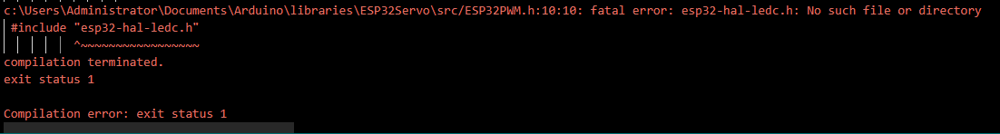
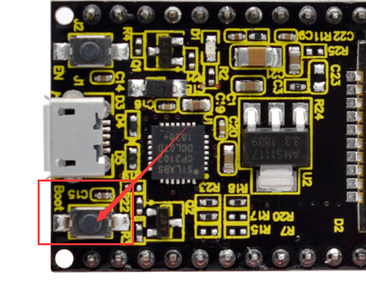
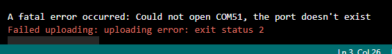
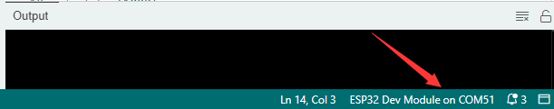

## FAQ

### Q: Arduino IDE Compilation Error

1. If `ESP32Servo` library is not installed, an error will occur. So please install `ESP32Servo` library (ESP32Servo library file version 1.2.1).

2. If an error shows below, you may select no development board or a wrong one, or your ESP32Servo library version is not 1.2.1. Please choose `ESP32 Dev Module` during uploading.

3. When “— —…..— —…..— —….” appears and the uploading is exited with an error, please click the "upload" button on IDE and then press the `Boot` button on ESP32:

4. If the error says the port does not exist, please check whether the COM port is connected or corrected. If you are not sure which is correct, you can unplug the USB cable of the development board to check which COM port has disappeared but appears after USB is connected.

5. If the COM port for Arduino IDE suffers a connection instability (The COM port status in the lower right corner), please connect to an external DC power (being powered ON). When the current of the computer USB port cannot meet the working needs of the robot arm, the ESP32 cannot work normally, so then the connection is unstable. 

### Q: Servo cannot rotate.

A: 

1. Before mounting the servo, please set servo angle first.
2. Please check whether the external power is sufficient. 

### Q: The value of joystick cannot reach 4095.

A: It is without an external power supply. Or the power runs out. (External power voltage: 7-12V)

### Q: WiFi cannot be connected.

A: 

1. Place the ESP32 board beside the router and reboot the board. Wait for connection.
2. Please check whether the WiFi name and passwords are correct.
3. Please check what the frequency of wifi is. The esp32 only connects wifi at a frequency of 2.4GHz.

------

### Q: Sensors respond slowly when remote control via web.

A: Reasons for slow router network transmission:

- Router CPU may be crowding for multiple connections, so please restart the router to reconnect.
- If the router system is used for a long time, reboot it.
- Wireless interference may exist. When wireless signals are unstable, do not use through walls.

For more router knowledge, please **google** it.
