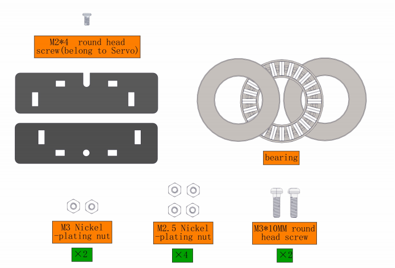
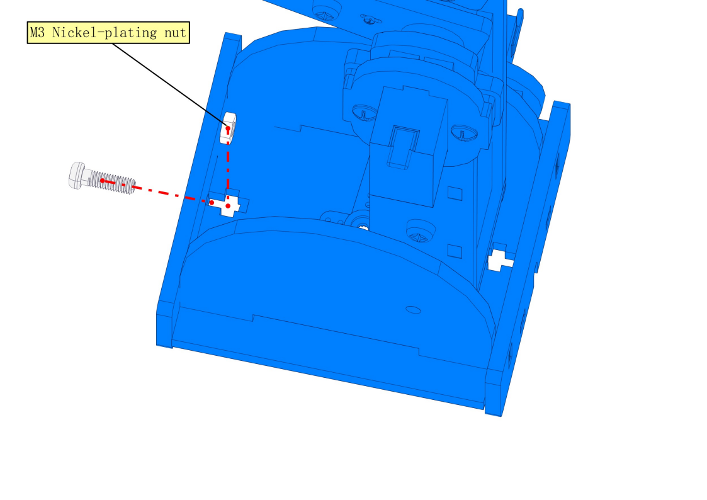

# ESP32 Smart Robot Arm


**Read Me First**

1. Please download all the files needed to run the robot arm, including the driver, codes, libraries, etc: https://fs.keyestudio.com/FKS0003

2. Technical Support: service@keyestudio.com

3. What do you need to prepare:

   - Six AA batteries or two 18650 batteries
   - A computer with a stable Internet connection
   - We can use the joystick to control the robot arm. But if you want to control it wirelessly, you need to prepare a ***\*2.4 GHz\**** WiFi(It can be a mobile hotspot or a router)


## 1. Kit List

**Please check the list to ensure that all parts are intact. If you find missing ones, please contact our sales staff immediately.**

|  #   |                             PIC                              |                             NAME                             | QTY  |
| :--: | :----------------------------------------------------------: | :----------------------------------------------------------: | :--: |
|  1   |               |              Keyestudio ESP32 servo drive board              |  1   |
|  2   |               |                 keyestudio ESP32 Core board                  |  1   |
|  3   |               |                  Keyestudio Joystick Module                  |  2   |
|  4   |               |                     3D PS2 joystick cap                      |  2   |
|  5   |               |                     Acrylic handle T=3MM                     |  1   |
|  6   |               |                  MG90S 14G 180° metal servo                  |  3   |
|  7   |               |                 9G 180° servo for robot claw                 |  1   |
|  8   |               |          DC 6-slot AA battery holder 15CM connector          |  1   |
|  9   |  | 2 18650 battery packs <br />(recommended to use pointed 18650 batteries) |  1   |
|  10  |              |                   F-F 50CM/10P DuPont wire                   |  1   |
|  11  |              |                      cable tie 3*100MM                       |  7   |
|  12  |              |                       Micro USB cable                        |  1   |
|  13  |              | 3 pin M-F 20CM DuPont wire (used to extend the wire of the clip) |  1   |
|  14  |              |                 3*40MM Phillips screwdriver                  |  1   |
|  15  |              |                         M2+M3 wrench                         |  1   |
|  16  |              | F693ZZ motor class<br />Inner: 3MM; Outer: 8MM; Thickness: 4MM |  3   |
|  17  |              | AXK 3-plate flat bearing<br />Inner: 20MM; Outer: 35MM, Thickness: 4MM |  1   |
|  18  |              | 2 bearing covers(You need to tear off the brown protective film) |  1   |
|  19  |              |                       4 acrylic board                        |  1   |
|  20  |              |                            M3 nut                            |  14  |
|  21  |              |                            M2 nut                            |  4   |
|  22  |              |                     M3 self-locking nut                      |  8   |
|  23  |              |                           M2.5 nut                           |  8   |
|  24  |              |                   M3*6MM round head screw                    |  4   |
|  25  |              |                   M2*10MM round head screw                   |  4   |
|  26  |              |                   M3*8MM round head screw                    |  4   |
|  27  |              |              M1.2*5MM self-tapping screw 2.54MM              |  2   |
|  28  |              |                   M3*10MM round head screw                   |  3   |
|  29  |              |                   M3*12MM round head screw                   |  5   |
|  30  |              |                M3*6MM round head nylon screw                 |  8   |
|  31  |              |                M3*16mm dual-pass nylon pillar                |  2   |
|  32  |              |                M3*22mm dual-pass nylon pillar                |  2   |
|  33  |              |                  M2*8MM self-tapping screw                   |  4   |
|  34  |              |              M1.2*4MM self-tapping screw 2.54MM              |  4   |
|  35  |              |                    M3*8MM flat head screw                    |  2   |
|  36  |              |            M2.5*25+6MM single-pass copper pillar             |  8   |
|  37  |              |                  M2.5*6MM round head screw                   |  8   |
|  38  |              |                 M1.4*6MM self-tapping screw                  |  4   |
|  39  |              |              M3*6+6MM single-pass copper pillar              |  6   |
|  40  |              |                   M3*14MM flat head screw                    |  2   |


## 2. Description

Based on ESP32 control board, we designed a complete kit that includes the required hardware and tools for you to build up a programmable robot arm. In the tutorials we provide, you can control it with a joystick, you can also control it using a mobile phone or a computer connected to the same wifi as our ESP32 board. It can reach out, grab, pick up and move small objects, and it has a memory function to repeat the actions you set.

This is an ideal maker project for beginners to learn the ESP32 board and servo. 


## 3. Parameters

Operating voltage: 3.3~5V

DC input voltage: 7~12V

Battery holder: 6-slot AA battery holder  / 2-slot 18650 battery holder (Batteries not included)

DOF: 4 degree of freedom


## 4. Features

**Flexibility**: With 4 degrees of freedom, the robot arm is able to move and rotate in multiple directions to perform complex actions and tasks.

**Convenient Control**: The ESP32 microcontroller is used as the control core, and its rich interface are convenient for communication and control with other devices or systems.

**Programming Flexibility**: Automatic operations can be realized via programming, such as planning motion trajectory, grasping and placing objects.

**Openness and Expandability**: The ESP32 platform contains an open ecosystem to be customizes and extended according to needs. You can add sensors and actuators to fit for multiply application.


## 5. KEYESTUDIO ESP32 Main Board


### 5.1 Introduction

Based on ESP-WROOM-32, the keyestudio ESP32 Core board is a mini development board, whose I/O pins are reserved a space of 2.54mm on both sides, so that it can be connected to peripherals according to needs. In addition, these pins also make your operation more concise and convenient when  using and debugging.

The ESP-WROOM-32 module adopts industry's leading WiFi + Bluetooth solution. Its external components is fewer than 10, including an antenna switch, RF balun, power amplifier, low noise amplifier, filter and power management module. It also integrates TSMC low-power 40nm technology, featuring high power performance and RF performance. Besides, it is safe, reliable, and easy to expand to various applications.

### 5.2 Parameters

Microcontroller: ESP-WROOM-32 module

USB-to-serial chip: CP2102-GMR

Operating voltage: DC 5V

Operating current: 80mA (average)

Supply current: 500mA (minimum)

Operating voltage: -40°C ~ +85°C 

WiFi mode: Station/SoftAP/SoftAP+Station/P2P

WiFi protocol: 802.11 b/g/n/e/i (802.11n, speed up to 150 Mbps)

WiFi frequency range: 2.4 GHz ~ 2.5 GHz

Bluetooth Protocol: BT v4.2 BR/EDR and BLE standard

Dimensions: 55x26x13mm

Weight: 9.3g

### 5.3 Pin-out


Although ESP32 board boasts fewer pins than commonly used processors, you will not encounter any problems when you reuse multiple functions on pins (pins IO36, IO35, IO34, IO39 only inputs signals).

**ATTENTION**: The voltage of ESP32 pins is 3.3V. If it works with other devices with an operating voltage of 5V, a level converter is required.

● **Power**: 2 power supply pins +5V and 3.3V, used to power other devices and modules.


● **GND**: 3 GND pins.

● **Enable pin(EN)**: used to enable or disable modules. The pin enables module at high and disables at low.

● **I/O pin(GPIO)**: 32 GPIO pins, used to communicate with LED, switches, and other input/output devices. These pins can be pulled up or down.

**NOTE: GPIO6 - GPIO11(SCK/CLK, SDO/SD0, SDI/SD1, SHD/SD2,S WP/SD3, SCS/CMD) are used for SPI communication of flash memory inside the module, which are not recommend.**

● **ADC**: 16 ADC pins, used to convert analog voltage(some sensor outputs) to digital voltage. Some of these converters are connected to internal amplifiers so are able to measure small voltages with high accuracy.

● **DAC**: 2 digital-to-analog converters with 8-bit accuracy. 

● **Touch pad**: 10 pins that are sensitive to capacitance changes. Touch buttons can be built by connecting these pins to certain pads (pads on the PCB).

● **SPI**: 2 SPI interfaces, used to connect to displays, SD / microSD card, external flash memory, etc.

● **I2C**: Pins SDA and SCL are used for I2C communication.

● **Serial Communication (UART)**: 2 UART serial ports, used to transmit data up to 5Mbps between devices. UART0 also boasts CTS and RTS control function.

● **PWM**: all I/O pins can be used for PWM(pulse width modulation) to control motors, LED brightness and colors, and so on.

### 5.4 Main Parts


## 6. ESP32 Servo Drive Board

### 6.1 Description

The KEYESTUDIO ESP32 servo drive board has 6 servo drive ports (5V), 9 IO ports (3.3V), and two IIC interfaces (3.3V). The servo drive uses two LM2596S-5.0V 3A high current power ICs to provide working voltage to the servo. Then, 1117 3.3V supplies power to 9 IO ports and IIC ports.

### 6.2 Parameters

External power: 7-12V

Servo pin voltage: 5V

IO port voltage: 3.3V

Dimensions: 90 x 55 x 15.5mm

Weight: 41g (bare board)

### 6.3 Pin-out


### 6.4 Schematic Diagram

[Schematic Diagram.PDF](./schematic_diagram.pdf)


## 7. Configure Arduino IDE

### 7.1 Download and install Arduino IDE

You could download the latest Arduino IDE from the official website: https://www.arduino.cc/en/software

There are versions for Windows, Mac, and Linux systems. 

Here we will choose the Windows version to show you how to download, install and use it. You can choose between the Installer (.exe) and the Zip packages. We suggest you use the first one that installs directly everything you need to use the Arduino Software (IDE), including the drivers. With the Zip package you need to install the drivers manually. The Zip file is also useful if you want to create a portable installation.

- 1.Select Win 10 and newer, 64 bits in DOWNLOAD OPTIONS.


- 2.Click JUST DOWNLOAD


- 3.Join Newsletter or you can just Click JUST DOWNLOAD


- 4.Save the .exe file downloaded from the software page to your hard drive and simply run the file .


- 5.Read the License Agreement and agree it.


- 6.Choose the installation options.


- 7.Choose the install location.


- 8. In addition, the security center may pop up a few times asking you if you want to install some device driver. Please install all of them.


- 9.Click finish and run Arduino IDE


- 10.Firewall will ask whether we'd like to give allow access, just simply click on Allow access.


- 10.Firewall will ask whether we'd like to give allow access, just simply click on Allow access.
11.Wait for some time to allow arduino IDE to automatically install the Arduino AVR Boards, built-in libraries, and other required files.


---

### 7.2 Introduce of Arduino IDE 2.0

**Verify / Upload** - compile and upload your code to your Arduino Board.
**Select Board & Port** - detected Arduino boards automatically show up here, along with the port number.
**Sketchbook** - here you will find all of your sketches locally stored on your computer. Additionally, you can sync with the Arduino Cloud, and also obtain your sketches from the online environment.
**Boards Manager** - browse through Arduino & third party packages that can be installed. For example, using a MKR WiFi 1010 board requires the Arduino SAMD Boards package installed.
**Library Manager** - browse through thousands of Arduino libraries, made by Arduino & its community.
**Debugger** - test and debug programs in real time.
**Search** - search for keywords in your code.
**Open Serial Monitor** - opens the Serial Monitor tool, as a new tab in the console.

If you want to learn more about Arduino IDE, please refer to this document：[**Getting Started with Arduino IDE 2**](https://docs.arduino.cc/software/ide-v2/tutorials/getting-started-ide-v2/)

---

### 7.3 Install Driver for ESP32 board

The USB-to-serial chip of the ESP32 board is CP2102-GMR.

Connect the ESP32 board to the computer with the usb cable and wait for Windows to begin its driver installation process. Often CP2102 drivers will be automatically installed by your system when using Arduino. You can check the Device Manager or the port of the Arduino IDE to see if the driver is successfully installed.

Open the **Device Manager** by right clicking **“My computer” **and selecting **control panel**.
Look under **Ports (COM & LPT)**. You should see an open port named **Silicon Labs CP210x USB to UART Bridge (COM-X)**
Click **Tools>Port** at Arduino IDE, you can find the com port displayed by device manager


If **the installation process fail**, you should see a device with a tiny yellow triangle and exclamation mark next to it.


**Now let's install CP210x Chip driver manually.**

1. In the tutorial package we downloaded(https://fs.keyestudio.com/FKS0003), you can find the CP210x_6.7.4 driver file.


2. Right click on the **"CP210x USB to UART Bridge Controller"** and choose the **"Update Driver Software"** option.


3. Choose the **"Browse my computer for Driver software"** option.


4. Select the driver file named **"CP210x_6.7.4"**, located in the tutorial package we downloaded.


5. After a while, the driver is installed successfully.


---

### 7.4 Configure the ESP32 environment in Arduino


<p style="color:red;">NOTE: ESP32 environment in Arduino **2.0.12** is recommended, since our tutorials are based on this version. Incompatibilities may exist if other versions are choosed.</p>

---


For Windows, there is an easier way to install the ESP32 environment. 
Double click the downloaded program `esp32_package_2.0.12_arduinome.exe` in the tutorial package to enable the automatic installation. 


Wait for its installation process to complete


You can also find the download link to the `esp32_package_2.0.12_arduinome.exe` : [https://fs.keyestudio.com/ESP32](https://fs.keyestudio.com/ESP32)

After the installation is complete, type ESP32 in the BOARDS MANAGER of the Arduino IDE, you will see the the ESP32 environment in Arduino: 2.0.12 (ESP32 by Espressif Systems)


---

### 7.5 Adjust the servo to 90° before assembly
We need to adjust all the servos to 90° before assembly so that the robotic arm will work as preset. Otherwise, the robot will not work and the servos may be burned out.

1. Prepare four servos, an EPS32 board, an ESP32 shield, and a USB cable.

| #    | PIC                                             | NAME                               | QTY  |
| ---- | ----------------------------------------------- | ---------------------------------- | ---- |
| 1    |  | Keyestudio ESP32 servo drive board | 1    |
| 2    |  | keyestudio ESP32 Core board        | 1    |
| 3    |  | MG90S 14G 180° metal servo         | 3    |
| 4    |  | 9G 180° servo for robot claw       | 1    |
| 5    |  | Micro USB cable                    | 1    |

2.Wiring:

| Servo drive board |   Servo   |
| :---------------: | :-------: |
|   IO17(yellow)    | S(yellow) |
|      5V(red)      |  V(red)   |
|    GND(black)     | G(brown)  |

<p style="font-size:18px;color:red;">Pay attention to the installation direction of the EPS32 board. Installing it in reverse may burn it.</p>


3.Connect the ESP32 board to the computer with the USB cable.
Select board type **"ESP32 Dev Module"**


4.Select port COM-4 (This depends on the number your computer assigns to the ESP32 board, which you can check in the device manager).


5.Before uploading code, please import “ESP32Servo” library to Arduino IDE to avoid compiling failure.

 <p style="color:red">The library file version must be 1.2.1, otherwise an error will also be reported. How to import "ESP32Servo" library:</p>

- [ ] Click the **LIBRARY MANAGER** button in the upper left corner of the Arduino IDE. 
- [ ] Enter **"ESP32servo"** in the search box.
- [ ] Choose the 1.2.1 version of the **"ESP32servo"** library.
- [ ] Click to **INTALL** it.


6.Open the code named ***\*Adjust_the_servo_to_90_degrees\**** using the Arduino IDE and upload it. 


Or directly copy the code below into the Arduino IDE and click upload.

```c
/*
  Keyestudio ESP32 Robot Arm
  7-5 Servo Configuration
  Function: set servo at pin IO17 to the angle of 90°
  http://www.keyestudio.com
*/
#include <ESP32Servo.h>

// create a servo objects ，Customizable name
Servo servo;
int servoPin = 17; //Connect servo to pin IO17

void setup()
{ 
  servo.attach(servoPin);  
  servo.write(0);  //Set servo angle to 0°
  delay(1000);
  servo.write(180);  //Set servo angle to 180°
  delay(1000);   
  servo.write(90);  //Set servo angle to 90°
}

void loop() {
}
```

After uploading the code, the servo will initialize to 0° first. Then it rotates from 0 to 180° and then it maintains at 90°. We need to ensure the servo is at 90° position before installing.

Operate all servos in this way to adjust the angle of the servos to 90°


## 8. Assembly

### 8.1 Install Battery Holder(You can choose between two options.)

8.1.1 Mount Six-slot AA Battery Holder


Required parts:


Steps:


8.1.2 Mount Two-slot 18650 Battery Holder：

Required parts:


Steps:

-2.png)


8.1.3 Replace the Battery Holder

To Remove the six-slot AA Battery Holder：

Loosen the M3 screw and move the battery case towards the centre


Push the battery case outward to remove it and replace it with another one.


### 8.2 Install Expansion Board and ESP32 Development Board

Required parts:


Steps:


### 8.3 Install the base of the robot arm

Required parts:


Steps:


### 8.4 Install the bearing and servo into the base

Required parts:


Steps:

<p style="color:red">Note the pit marked in green as follows:</p>


NOTE：1.We need to adjust the servo to 90° before assembly.
               2.Note the pit marked in green as follows


### 8.5 Install the base of the turntable

Required parts:


Steps:


### 8.6 Install right-side upper arm and its servo

Required parts:


NOTE：We need to adjust the servo to 90° before assembly.


NOTE：1.We need to adjust the servo to 90° before assembly.
               2.Note the orientation of the holes marked by the green circles.
Vertically mount it as follows:
Step1：Fix the servo arm to the acrylic with a M1.2*5 screw
Step2：Use a M2*4 screw to mount the acrylic on the servo shaft, taking care to keep the acrylic level with the edge of the servo.


### 8.7 Install right-side Forearm

Required parts:


Steps:


### 8.8 Install left-side forearm and servo

Required parts:


Steps:


NOTE:  
1.We need to adjust the servo to 90° before assembly.
2.As marked by the two arrows, the slope of the forearm should be aligh with the carved line on the upper arm.


### 8.9 Install the robot's elbow and servo

Required parts:


Steps:


### 8.10 Install Claw

Required parts:


NOTE:  
1.We need to adjust the servo to 90° before assembly.
2.When assembling the gear and clip, do not turn the servo shaft to avoid changing its already adjusted 90° position.


### 8.11 Install the arm

Required parts:


Steps: ①②③④


### 8.12 Intall the arm to the base

Required parts:



Steps:





NOTE：
1.We need to adjust the servo to 90° before assembly.
2.Note the pit marked in green as follows


### 8.13 Fixing the robot arm to the robot base


### 8.14 Install Joystick

Required parts:


Steps:


### 8.15 Wiring

Servo wiring: 

Connect the corresponding servo motor to the corresponding IO port according to the schematic diagram of the image（The wiring is consistent with the angle settings of each servo motor）

  


<p style="color:red;">Attention: The servo of the claw part requires a longer wiring, so a 3-pin DuPont cable is used for connection</p>


Joystick wiring:

| Servo drive board | Left joystick module |
| :---------------: | :------------------: |
|      5V(red)      |          V           |
|    GND(black)     |          G           |
|   IO12(yellow)    |          B           |
|   IO13(yellow)    |          X           |
|   IO15(yellow)    |          Y           |

| Servo drive board | Right joystick module |
| :---------------: | :-------------------: |
|      5V(red)      |           V           |
|    GND(black)     |           G           |
|   IO25(yellow)    |           B           |
|   IO33(yellow)    |           X           |
|   IO32(yellow)    |           Y           |


## 9. Robot Arm Projects

### 9.1 Control the turntable of the robotic arm


**9.1.1 Introduction**

Servo is a position driver, which is mainly composed of a shell, a circuit board, a non-core motor, a gear and a position detector. When a receiver or an MCU sends a signal to the steering gear, its built-in reference circuit generates a reference signal with a period of 20ms and a width of 1.5ms. The obtained DC bias voltage will be compared with the voltage of the potentiometer to output a voltage difference.

There are many specifications of the servo, and generally most of them conclude three external wires in brown(grounded), red(power positive), orange(signal), Yet the colors may vary from brands. 


**9.1.2 Parameters**

Operating voltage: DC 4.8V 〜 6V

Dimensions: 32.2 x 12 x 33.3mm   

Torque: 2.0kg (4.8v)    

Speed: 0.11s (4.8v)   

Rotation angle: Maximum 180°

Pulse width range: 500→2500 μsec

Servo type: Analog servo       

Operating temperature: 0°-55°      

Dead-time: 5 microseconds

Structure material: metal copper gear, hollow cup motor, double ball bearing

**9.1.3 Principle**

The rotation angle of the servo can be controlled by adjusting the duty cycle of the PWM (pulse width modulation) signal. 

The period of the standard PWM (pulse width modulation) signal is fixed at 20ms (50Hz). Theoretically,  pulse width should be within 1ms ~ 2ms, but in fact, the range is 0.5ms ~ 2.5ms, corresponding to the rotation angle of 0° to 180°.


Corresponding servo Angle value:


**9.1.4 Wiring Diagram**


In the previous assembly steps, we connected the **servo where the turntable is located** to the IO16.
<p style="color:red;">External power supply is required, because the current of the development board is far from meeting the relatively large current requirements for driving the servo.</p>


**9.1.5 Upload Code**

Before uploading code, please import “ESP32Servo” library to Arduino IDE to avoid compiling failure. 

<p style="color:red">The library file version must be 1.2.1, otherwise an error will also be reported. How to import "ESP32Servo" library:</p>


- [ ] Click the **LIBRARY MANAGER** button in the upper left corner of the Arduino IDE. 
- [ ] Enter **"ESP32servo"** in the search box.
- [ ] Choose the 1.2.1 version of the **"ESP32servo"** library.
- [ ] Click to **INTALL** it.


Use the Arduino IDE to open this code directly from the tutorial package.

Connect the ESP32 board to the computer with the USB cable.
Select board type "ESP32 Dev Module" and select port COM-XX (This depends on the number your computer assigns to the ESP32 board, which you can check it in the device manager).


Or you can copy and paste the code from below into the Arduino IDE.

```c
/*
  Keyestudio ESP32 Robot Arm
  9-1 tutorial code
  Function: control the servo to rotate to 0°, 90°, 180°
  http://www.keyestudio.com
*/
#include <ESP32Servo.h>

// create a servo objects ，Customizable name
Servo servo;
int servoPin = 16; //Connect servo to pin IO16

void setup()
{ 
  servo.attach(servoPin);   
}

void loop() {
    servo.write(0);  //Set servo angle to 0°
    delay(1000);	//Delay 1s
    servo.write(90);  //Set servo angle to 90°
    delay(1000);
    servo.write(180);  //Set servo angle to 180°
    delay(1000);
}
```

9.1.6 Test Result

After uploading the code, the servo rotates from 0° to 90° and delays for 1s, and then rotates to 180° and also delays for 1s. At last, it back to 0° to repeat these actions. **We're going to see the robot arm turn from side to side.**


### 9.2 Read Analog Value of Joystick

9.2.1 Introduction

The joystick module adopts a PS2 handle rocker. When controlling, we connect the X and Y ports to the analog port of the MCU, port B to the digital port, VCC to the power output(3.3-5V), and GND to the GND. We can read the power level of the digital port and two analog values to know the state of the joystick module.

9.2.2 Parameters

Operating voltage: 3.3V ~ 5V

Three axes: X, Y, Z

Dimensions: 44.2 x 28 x 32.8mm

9.2.3 Principle

Axis X and Y are actually two potentiometers. 

As shown below, the analog value of the X(Y) axis ranges from 0 ~ 4095 (the analog value of ESP32 is 0 ~ 4095).


The analog value will decrease in the Y-axis upward because the resistance of the output pin to the ground is decreasing, and the resistance will be increasing in the downward direction. So does it in the X-axis (direction: right and left).


9.2.4 Read the values of the two joysticks and print them on the serial monitor.

Before uploading code, please import “ESP32Servo” library to Arduino IDE to avoid compiling failure. 

<p style="color:red">The library file version must be 1.2.1, otherwise an error will also be reported. How to import "ESP32Servo" library:</p>

Use the Arduino IDE to open this code directly from the tutorial package.

Connect the ESP32 board to the computer with the USB cable.
Select board type "ESP32 Dev Module" and select port COM-XX (This depends on the number your computer assigns to the ESP32 board, which you can check it in the device manager).


Or copy the code below into the Arduino IDE and click upload.

```c
/*
  Keyestudio ESP32 Robot Arm
  9-2 tutorial code
  Function: 
  http://www.keyestudio.com
*/
//Define the left remote rod pin
#define left_B 12  
#define left_X 13
#define left_Y 15
//Define the right remote rod pin
#define right_B 25
#define right_X 33
#define right_Y 32
//Define variables for storing remote sensing values
int left_B_data, left_Y_data, left_X_data, right_B_data, right_X_data, right_Y_data;  

void setup() {
  // put your setup code here, to run once:
  Serial.begin(9600);
  pinMode(left_B, INPUT);   //Set pins to input mode
  pinMode(left_X, INPUT);
  pinMode(left_Y, INPUT);
  pinMode(right_B, INPUT);
  pinMode(right_X, INPUT);
  pinMode(right_Y, INPUT);
}
void loop() {
  // put your main code here, to run repeatedly:
  left_B_data = digitalRead(left_B);    
  left_X_data = analogRead(left_X);
  left_Y_data = analogRead(left_Y);

  right_B_data = digitalRead(right_B);
  right_X_data = analogRead(right_X);
  right_Y_data = analogRead(right_Y);

  Serial.print(" left B:");
  Serial.print(left_B_data);
  Serial.print("    left X:");
  Serial.print(left_X_data);
  Serial.print("    left Y:");
  Serial.println(left_Y_data);
  
  Serial.print("right B:");
  Serial.print(right_B_data);
  Serial.print("   right X:");
  Serial.print(right_X_data);
  Serial.print("   right Y:");
  Serial.println(right_Y_data);
  delay(300);
}

```


Result

After uploading the code, open the **serial port monitor** and set the serial port baud rate to **9600**, you will see the printed remote control value on it. If you feel that the serial port printing speed is too fast, you can increase the value in the parentheses of the delay ().


### 9.3 Joystick Control Robot Arm

9.3.1 Introduction

We connect the ESP32 development board and the joystick module to the servo drive board, and then the development board reads the value of the axis X/Y of the module to determine the rotation angle, so that the arm is controlled by the module.

9.3.2 Flow


#### 9.3.3 Control the robot with the joystick.

Use the Arduino IDE to open this code directly from the tutorial package.


Or you can copy and paste the code from below into the Arduino IDE.
```c
/*
  Keyestudio ESP32 Robot Arm
  9-3-3 tutorial code
  Function: joystick control the robot arm
  http://www.keyestudio.com
*/
#include "ESP32Servo.h"
Servo base;  // create servo object to control a servo
Servo arm;
Servo forearm;
Servo gripper;
//set servo control pins
#define basePin 16
#define armPin 17
#define forearmPin 2
#define gripperPin 4
//set left joystick pins
#define left_B 12
#define left_X 13
#define left_Y 15
//set right joystick pins
#define right_B 25
#define right_X 33
#define right_Y 32
int left_B_data, left_Y_data, left_X_data, right_B_data, right_X_data, right_Y_data;
//servo
int baseAngle = 90;     // Initialize bottom servo angle
int armAngle = 90;       // Initialize upper arm servo angle
int forearmAngle = 90;  // Initialize forearm servo angle
int gripperAngle = 90;  // Initialize claw servo angle

void setup() {
  // put your setup code here, to run once:
  Serial.begin(9600);
  pinMode(left_B, INPUT);
  pinMode(left_X, INPUT);
  pinMode(left_Y, INPUT);
  pinMode(right_B, INPUT);
  pinMode(right_X, INPUT);
  pinMode(right_Y, INPUT);

  base.attach(basePin);  // attaches the servo on pin 16 to the servo object
  arm.attach(armPin);
  forearm.attach(forearmPin);
  gripper.attach(gripperPin);

  base.write(baseAngle);
  arm.write(armAngle);
  forearm.write(forearmAngle);
  gripper.write(gripperAngle);
}

void loop() {
  // put your main code here, to run repeatedly:
  left_B_data = digitalRead(left_B);
  left_X_data = analogRead(left_X);
  left_Y_data = analogRead(left_Y);

  right_B_data = digitalRead(right_B);
  right_X_data = analogRead(right_X);
  right_Y_data = analogRead(right_Y);

  baseControl();
  armControl();
  forearmControl();
  gripperControl();
}

//control base
void baseControl() {
  if (left_X_data > 3000) {
    while (analogRead(left_X) > 3000) {
      base.write(baseAngle++);
      if (baseAngle >= 180) baseAngle = 180;
      delay(10);
    }
  } else if (left_X_data < 20) {
    while (analogRead(left_X) < 20) {
      base.write(baseAngle--);
      if (baseAngle <= 0) baseAngle = 0;
      delay(10);
    }
  }
}

//control upper arm
void armControl() {
  if (left_Y_data > 3000) {
    while (analogRead(left_Y) > 3000) {
      arm.write(armAngle++);
      if (armAngle >= 180) armAngle = 180;
      delay(10);
    }
  } else if (left_Y_data < 20) {
    while (analogRead(left_Y) < 20) {
      arm.write(armAngle--);
      if (armAngle <= 80) armAngle = 80;
      delay(10);
    }
  }
}

//control forearm
void forearmControl() {
  if (right_Y_data < 20) {           
    while (analogRead(right_Y) < 20) {
      forearm.write(forearmAngle++);
      if (forearmAngle >= 120) forearmAngle = 120;
      delay(10);
    }
  } else if (right_Y_data > 3000) {
    while (analogRead(right_Y) > 3000) {
      forearm.write(forearmAngle--);
      if (forearmAngle <= 30) forearmAngle = 30;
      delay(10);
    }
  }
}

//control claw
void gripperControl() {
  if (right_X_data > 3000) {
    while (analogRead(right_X) > 3000) {
      gripper.write(gripperAngle++);
      if (gripperAngle >= 150) gripperAngle = 150;
      delay(10);
      // gripper.write(180);
    }
  } else if (right_X_data < 20) {
    while (analogRead(right_X) < 20) {
      // gripper.write(80);
      gripper.write(gripperAngle--);
      if (gripperAngle <= 90) gripperAngle = 90;
      delay(10);
    }
  }
}

```

9.3.4 Test Result

After uploading the code, rotate joysticks to control the arm.

For the left joystick, axis X controls the entire rotation of the robot arm (X < 20: turn right; X > 3000: turn left); its axis Y raises and lowers the upper arm (Y < 20: up; Y > 3000: down).

For the right joystick, axis X controls the claw (X < 20: splay; X > 3000: clench); axis Y raises and lowers the forearm (Y < 20: up; Y > 3000: down).

Push up the joystick module to raise up axis Y, so its value decreases, and push down to increase the value of axis Y. The working principle of the upper arm and the forearm are alike.


#### 9.3.5 Remember and repeat the action

The current angle of the servo can be stored continuously for 10 times by pressing the button on the right joystick, and the action playback can be performed when we press the button on the left joystick.

9.3.5.1 Flow


9.3.5.2 Code

Use the Arduino IDE to open this code directly from the tutorial package.

Connect the ESP32 board to the computer with the USB cable.
Select board type "ESP32 Dev Module" and select port COM-XX (This depends on the number your computer assigns to the ESP32 board, which you can check it in the device manager).


Or you can copy and paste the code from below into the Arduino IDE.
```c
/*
  Keyestudio ESP32 Robot Arm
  9-3-5 tutorial code
  Function: joystick controls arm, axis z stores the rotation angle and re-plays the action
  http://www.keyestudio.com
*/
#include "ESP32Servo.h"
Servo base;  // create servo object to control a servo
Servo arm;
Servo forearm;
Servo gripper;
//Define servo control pin
#define basePin 16
#define armPin 17
#define forearmPin 2
#define gripperPin 4
//Define left joystick pin
#define left_B 12
#define left_X 13
#define left_Y 15
//Define right joystick pin
#define right_B 25
#define right_X 33
#define right_Y 32
int left_B_data, left_Y_data, left_X_data, right_B_data, right_X_data, right_Y_data;
//servo
int baseAngle = 90;     // initialize base servo angle
int armAngle = 90;      // initialize upper arm servo angle
int forearmAngle = 90;  // initialize forearm servo angle
int gripperAngle = 90;  // initialize claw servo angle

int attitude_data[4][11];
int base_attitude = 0;
int arm_attitude = 1;
int forearm_attitude = 2;
int gripper_attitude = 3;
int data_start_bit = 1;
int data_end_bit = 0;

void setup() {
  // put your setup code here, to run once:
  pinMode(left_B, INPUT);
  pinMode(left_X, INPUT);
  pinMode(left_Y, INPUT);
  pinMode(right_B, INPUT);
  pinMode(right_X, INPUT);
  pinMode(right_Y, INPUT);
  Serial.begin(9600);
  base.attach(basePin);  // attaches the servo on pin 16 to the servo object
  arm.attach(armPin);
  forearm.attach(forearmPin);
  gripper.attach(gripperPin);

  base.write(90);
  arm.write(90);
  forearm.write(90);
  gripper.write(90);
}

void loop() {
  // put your main code here, to run repeatedly:
  left_B_data = digitalRead(left_B);
  left_X_data = analogRead(left_X);
  left_Y_data = analogRead(left_Y);

  right_B_data = digitalRead(right_B);
  right_X_data = analogRead(right_X);
  right_Y_data = analogRead(right_Y);

  attitude();
  baseControl();
  armControl();
  forearmControl();
  gripperControl();
}

//base control
void baseControl() {
  if (left_X_data > 3000) {
    while (analogRead(left_X) > 3000) {
      base.write(baseAngle++);
      if (baseAngle >= 180) baseAngle = 180;
      delay(10);
    }
  } else if (left_X_data < 20) {
    while (analogRead(left_X) < 20) {
      base.write(baseAngle--);
      if (baseAngle <= 0) baseAngle = 0;
      delay(10);
    }
  }
}

//upper arm control
void armControl() {
  if (left_Y_data > 3000) {
    while (analogRead(left_Y) > 3000) {
      arm.write(armAngle++);
      if (armAngle >= 180) armAngle = 180;
      delay(10);
    }
  } else if (left_Y_data < 20) {
    while (analogRead(left_Y) < 20) {
      arm.write(armAngle--);
      if (armAngle <= 80) armAngle = 80;
      delay(10);
    }
  }
}

//forearm control
void forearmControl() {
  if (right_Y_data < 30) {
    while (analogRead(right_Y) < 30) {
      forearm.write(forearmAngle++);
      if (forearmAngle >= 150) forearmAngle = 150;
      delay(10);
    }
  } else if (right_Y_data > 3000) {
    while (analogRead(right_Y) > 3000) {
      forearm.write(forearmAngle--);
      if (forearmAngle <= 30) forearmAngle = 30;
      delay(10);
    }
  }
}

//claw control
void gripperControl() {
  if (right_X_data > 3000) {
    while (analogRead(right_X) > 3000) {
      gripper.write(gripperAngle++);
      if (gripperAngle >= 150) gripperAngle = 150;
      delay(10);
      // gripper.write(180);
    }
  } else if (right_X_data < 20) {
    while (analogRead(right_X) < 20) {
      // gripper.write(80);
      gripper.write(gripperAngle--);
      if (gripperAngle <= 90) gripperAngle = 90;
      delay(10);
    }
  }
}

void attitude() {
  if (right_B_data == 1) {
    delay(10);  //eliminate button jitters
    if (right_B_data == 1) {

      attitude_data[base_attitude][data_start_bit] = base.read();
      delay(100);
      attitude_data[arm_attitude][data_start_bit] = arm.read();
      delay(100);
      attitude_data[forearm_attitude][data_start_bit] = forearm.read();
      delay(100);
      attitude_data[gripper_attitude][data_start_bit] = gripper.read();
      delay(100);
      data_start_bit++;
      data_end_bit = data_start_bit;
      if (data_start_bit > 10) data_start_bit = 10;
    }
  }
  if (left_B_data == 1) {
    delay(10);
    if (left_B_data == 1) {
      data_start_bit = 1;
      baseAngle = base.read();
      armAngle = arm.read();
      forearmAngle = forearm.read();
      gripperAngle = gripper.read();
      for (int i = 1; i < data_end_bit; i++) {
        //base
        if (baseAngle < attitude_data[base_attitude][i]) {
          while (baseAngle < attitude_data[base_attitude][i]) {
            base.write(baseAngle);
            delay(10);
            baseAngle++;
          }
        } else {
          while (baseAngle > attitude_data[base_attitude][i]) {
            base.write(baseAngle);
            delay(10);
            baseAngle--;
          }
        }
        //upper arm
        if (armAngle < attitude_data[arm_attitude][i]) {
          while (armAngle < attitude_data[arm_attitude][i]) {
            arm.write(armAngle);
            delay(10);
            armAngle++;
          }
        } else {
          while (armAngle > attitude_data[arm_attitude][i]) {
            arm.write(armAngle);
            delay(10);
            armAngle--;
          }
        }
        //forearm
        if (forearmAngle < attitude_data[forearm_attitude][i]) {
          while (forearmAngle < attitude_data[forearm_attitude][i]) {
            forearm.write(forearmAngle);
            delay(10);
            forearmAngle++;
          }
        } else {
          while (forearmAngle > attitude_data[forearm_attitude][i]) {
            forearm.write(forearmAngle);
            delay(10);
            forearmAngle--;
          }
        }
        //claw
        if (gripperAngle < attitude_data[gripper_attitude][i]) {
          while (gripperAngle < attitude_data[gripper_attitude][i]) {
            gripper.write(gripperAngle);
            delay(10);
            gripperAngle++;
          }
        } else {
          while (gripperAngle > attitude_data[gripper_attitude][i]) {
            gripper.write(gripperAngle);
            delay(10);
            gripperAngle--;
          }
        }
      }  //for end
    }
  }
}

```

9.3.5.3 Result

Every time you press the right joystick in the direction of acrylic, you can record an action, we can record up to 10 actions, after recording the action, press the left joystick in the direction of acrylic, the robot starts to execute the action just recorded.


### 9.4 WiFi Control Robot Arm

#### 9.4.1 Introduction


In this experiment, we will control the arm through WiFi. 

**You need to prepare:**
- a **2.4 GHz WiFi**. It can be a mobile hotspot or a router.
- a phone/IPAD/computer that can connect to the same internet.
- The network name and password of your wifi.

NOTE: 
In the all codes we provided for ESP32 control, you need to change the word **your_SSID** in the code to your WiFi name and **your_PASSWORD** in the code to your WiFi password before uploading.


#### 9.4.2 Connect the ESP32 board to WiFi

ESP32 Development Board comes with built-in Wi-Fi (2.4G) and Bluetooth (4.2) capabilities to easily connect to a Wi-Fi network and communicate with other devices in the network. You can use ESP32 to build web pages and display them in a browser.


**Arduino IDE includes a library \<WiFi.h\>, which configures and monitors ESP32 Wi-Fi networking.**

- Station Mode (STA mode / Wi-Fi client mode): ESP32 connects to a Wi-Fi hotspot (AP).
- AP Mode (Soft-AP mode / Wi-Fi hotspot mode): Other Wi-Fi devices connects to the ESP32.
- AP-STA Mode (ESP32 is both a Wi-Fi hotspot and a Wi-Fi device connecting to another Wi-Fi).
- Support multiple security modes: WPA, WPA2, WEP, etc.
- Support Wi-Fi searching: Active/passive scanning
- Support hybrid mode monitoring of IEEE802.11 Wi-Fi packets.

------

For more wifi reference, please visit: [https://docs.espressif.com/projects/esp-idf/en/latest/esp32/api-reference/network/esp_wifi.html](https://docs.espressif.com/projects/esp-idf/en/latest/esp32/api-reference/network/esp_wifi.html)

espressif official: [https://www.espressif.com.cn/en/home](https://www.espressif.com.cn/en/home)


**Connect the ESP32 board to WiFi:**

1. First we need to upload code to the ESP32 board to ensure the ESP32 correctly connects to Wifi. 

Use the Arduino IDE to open this code directly from the tutorial package.

Connect the ESP32 board to the computer with the USB cable.
Select board type "ESP32 Dev Module" and select port COM-XX (This depends on the number your computer assigns to the ESP32 board, which you can check it in the device manager).


Or you can copy and paste the code from below into the Arduino IDE.

```c++
/*
  Keyestudio ESP32 Robot Arm
 9-4-2 tutorial code
  Function: connect to wifi and print ESP32 IP address on the serial monitor
  http://www.keyestudio.com
*/
#include <WiFi.h>
// #include <WebServer.h>
/*ATTENTION:
  ESP32 only supports wifi at a frequency of 2.4GHz.
  If wifi fails to be connected, please check wifi name, passwords and frequency.
  Modify "your_SSID " into your wifi name
  Modify "your_PASSWORD" into your wifi passwords*/

 const char* ssid = "your_SSID";
 const char* password = "your_PASSWORD";

void setup() {
  Serial.begin(9600);
  //initialize Wifi
  WiFi.begin(ssid, password);
  //search wifi. while loop: if no wifi is connected, keep searching; state: connecting
  while (WiFi.status() != WL_CONNECTED) {
    delay(500);
    Serial.print(".");
  }
  Serial.println("");
  Serial.println("WiFi connected.");

  //wifi connected: print the IP address
  Serial.println("Connected to WiFi");
  Serial.println(WiFi.localIP());
}

void loop() {
}
```

In this code, please modify `your_ssid` and `your_password` into your Wi-Fi name and passwords respectively.

```c++
const char* ssid = "your_SSID";
const char* password = "your_PASSWORD";
```

After uploading the code, open the serial monitor you will see it prints the connecting state and IP address of your WIFI.


------

#### 9.4.3 Visit the IP Web Page


In this step, once esp32 board connect to the wifi, the ESP32's Web server will serve up web pages. In the following example, we will create a simple web page that says "Hello, World!". You can use the phone/IPAD/computer that connected to the same internet as ESP32 board to visit this web page.

Use the Arduino IDE to open this code directly from the tutorial package.

Connect the ESP32 board to the computer with the USB cable.
Select board type "ESP32 Dev Module" and select port COM-XX (This depends on the number your computer assigns to the ESP32 board, which you can check it in the device manager).


Or you can copy and paste the code from below into the Arduino IDE.


```c++
/*
  Keyestudio ESP32 Robot Arm
  9-4-3 tutorial code
  Function: Conenct to WiFi and print esp32 IP address, set up a web page saying “Hello World！”
  http://www.keyestudio.com
*/
#include <WiFi.h>
#include <WebServer.h>

/*ATTENTION:
  ESP32 only supports wifi at a frequency of 2.4GHz.
  If wifi fails to be connected, please check wifi name, passwords and frequency.
  Modify "your_SSID " into your wifi name
  Modify "your_PASSWORD" into your wifi passwords*/

 const char* ssid = "your_SSID";
 const char* password = "your_PASSWORD";

WiFiServer server(80);  //Set the web port to 80. You can directly enter the IP address to access the web page without entering the port number.

void setup() {
  Serial.begin(9600);
  // Connect to WiFi network
  Serial.println();
  Serial.println();
  Serial.print("Connecting to ");
  Serial.println(ssid);
  WiFi.begin(ssid, password);
  while (WiFi.status() != WL_CONNECTED) {
    delay(500);
    Serial.print(".");
  }
  Serial.println("");
  Serial.println("WiFi connected.");
  // Start the server
  server.begin();
  Serial.println("Server started");
  // Print the IP address
  Serial.print("IP Address: ");
  Serial.println(WiFi.localIP());
}

void loop() {
  WiFiClient client = server.available();  //Try to accept a request coming in from the WiFi server and assign it to a WiFiClient object named client
  if (!client) {                           //This conditional statement checks whether the connection from the client was successfully accepted. If not, exit execution immediately
    return;
  }
  Serial.println("New client");
  while (!client.available()) {           //The loop will wait until the client has sent the request and the data is available. While waiting, the code is delayed at 1 millisecond intervals
    delay(1);
  }
    
 // HTML Page
//A string defines a simple HTML page that contains a title "Hello World!"
 String webPage = "<html><head><title></title></head><body>";
  webPage += "<h1>Hello World!</h1>";
  webPage += "</body></html>"; 


  client.println("HTTP/1.1 200 OK");          //Sends an HTTP response header to indicate that the server successfully processed the request
  client.println("Content-Type: text/html");  //Set the type of the response content to HTML
  client.println("Connection: close");        //Disconnect to the client when the response is finished
  client.println();                           //Send a blank line to end the HTTP response header and to begin the body content
  client.println(webPage);                    //Send the defined HTML page content to the client, so that the client will receive a message containing "Hello World!" as a response

  delay(100); // Add a delay to ensure that the response is fully sent
  client.stop(); // Disconnect to client
}

```

------

After uploading code, the arduino serial monitor will display the ESP32 IP address. You can visit it in browser, and you will see the web page showing “Hello, World!”.**


**On PC:**


---

**On Mobile:**


#### 9.4.4 WiFi Control Robot Arm

<p style="background-color: yellow;font-size:22px;color:red;">In this project, some extracurricular knowledge are involved such as HTML, CSS and JS. Here is only a brief introduction. For detailed theories, please google them by yourself.</p>

9.4.3.1 Flow


9.4.4.2 Code

Use the Arduino IDE to open this code directly from the tutorial package.

Connect the ESP32 board to the computer with the USB cable.
Select board type "ESP32 Dev Module" and select port COM-XX (This depends on the number your computer assigns to the ESP32 board, which you can check it in the device manager).


Or you can copy and paste the code from below into the Arduino IDE.

Modify **your_SSID** and **your_PASSWORD** into your own wifi name and passwords:

```c++
const char *SSID = "your_SSID";
const char *PASS = "your_PASSWORD";
```

Code:

```c
/*
  Keyestudio ESP32 Robot Arm
  10-4-3-2 tutorial code
  Function: connect ESP32 to wifi to check IP address. Visit the address to enter a control panel to control the arm wirelessly
  http://www.keyestudio.com
*/
#include <WiFi.h>
#include <WebServer.h>
#include <ESP32Servo.h>
/*ATTENTION:
  ESP32 only supports wifi at a frequency of 2.4GHz.
  If wifi fails to be connected, please check wifi name, passwords and frequency.
  Modify "your_SSID " into your wifi name
  Modify "your_PASSWORD" into your wifi passwords*/

 const char* ssid = "your_SSID";
 const char* password = "your_PASSWORD";

WiFiServer server(80);  //Set the web port to 80. You can directly enter the IP address to access the web page without entering the port number

#define basePin 16    //set base servo pin to IO16
#define armPin 17     //set upper arm servo pin to IO17
#define forearmPin 2  //set forearm servo pin to IO2
#define gripperPin 4  //set claw servo pin to IO4

Servo base;  // create servo object to control a servo
Servo arm;
Servo forearm;
Servo gripper;
int baseAngle, armAngle, forearmAngle, gripperAngle;  //A variable used to store the current Angle of the servo

int slider1Value = 90;  // Default position
int slider2Value = 90;  // Default position
int slider3Value = 90;  // Default position
int slider4Value = 90;  // Default position

void setup() {
  Serial.begin(9600);
  base.attach(basePin);        // Connect base to pin 2
  arm.attach(armPin);          // Connect arm to pin 4
  forearm.attach(forearmPin);  // Connect forearm to pin 5
  gripper.attach(gripperPin);  // Connect gripper to pin 18
  delay(100);
  // Connect to WiFi network
  Serial.println();
  Serial.println();
  Serial.print("Connecting to ");
  Serial.println(ssid);
  //initialize Wifi
  WiFi.begin(ssid, password);
  //search wifi. while loop: if no wifi is connected, keep searching; state: connecting
  while (WiFi.status() != WL_CONNECTED) {
    delay(500);
    Serial.print(".");
  }
  Serial.println("");
  Serial.println("WiFi connected.");

  // Start the server
  server.begin();
  Serial.println("Server started");

  // Print the IP address
  Serial.print("IP Address: ");
  Serial.println(WiFi.localIP());
  base.write(90);       //initialize base servo angle to 90 degree
  delay(100);
  arm.write(90);        //initialize upper arm servo angle to 90 degree
  delay(100);
  forearm.write(90);    //initialize forearm servo angle to 90 degree
  delay(100);
  gripper.write(90);    //initialize claw servo angle to 90 degree
  delay(100);
}

void loop() {
  WiFiClient client = server.available();  //Try to accept a request coming in from the WiFi server and assign it to a WiFiClient object named client
  if (!client) {                           //This conditional statement checks whether the connection from the client was successfully accepted. If not, exit execution immediately
    return;
  }
  // Serial.println("New client");
  while (!client.available()) {  //The loop will wait until the client has sent the request and the data is available. While waiting, the code is delayed at 1 millisecond intervals
    delay(1);
  }

  String request = client.readStringUntil('\r');  // Read HTTP requests sent by clients until a carriage return ('\r') is encountered
  Serial.println(request);                        // Print requests on serial monitor for easy debugging
  client.flush();                                 // Clear the input buffer of the client to ensure that there is no residual data

  baseAngle = base.read();        // attain the current base servo angle
  armAngle = arm.read();          // attain the current upper arm servo angle
  forearmAngle = forearm.read();  // attain the current forearm servo angle
  gripperAngle = gripper.read();  // attain the current claw servo angle

  // search the positions of "slider1=", "slider2=", "slider3=", "slider4=" in the request string
  int pos1 = request.indexOf("slider1=");
  int pos2 = request.indexOf("slider2=");
  int pos3 = request.indexOf("slider3=");
  int pos4 = request.indexOf("slider4=");

  // If "slider1=" is found, extract subsequent values and converts them to integers, and then call baseControl function to control the base servo
  if (pos1 != -1) {
    int val1 = request.substring(pos1 + 8, pos1 + 11).toInt();  //Find the value and extract it
    baseControl(val1);                                          //assign the value to baseControl
  }
  // Similar operations for other slider
  if (pos2 != -1) {
    int val2 = request.substring(pos2 + 8, pos2 + 11).toInt();
    armControl(val2);
  }
  if (pos3 != -1) {
    int val3 = request.substring(pos3 + 8, pos3 + 11).toInt();
    forearmControl(val3);
  }
  if (pos4 != -1) {
    int val4 = request.substring(pos4 + 8, pos4 + 11).toInt();
    gripperControl(val4);
  }

  // HTML Page
  String webPage = "<!DOCTYPE html><html lang=\"en\"><head><meta charset=\"UTF-8\"><meta name=\"viewport\" content=\"width=device-width, initial-scale=1.0\"><title>ESP32 Servo Control</title>\
<style>body {font-family: Arial, sans-serif;background-color: #f5f5f5;margin: 0;padding: 0;}\
.container {max-width: 100%;margin: 20px auto;padding: 20px;background-color: #fff;border-radius: 10px;box-shadow: 0 0 10px rgba(0, 0, 0, 0.1);}\
h1 {text-align: center;color: #333;}\
.gauge-container {display: flex;align-items: center;margin-bottom: 20px;width: 100%;}\
.gauge-label {flex: 1;text-align: right;margin-right: 10px;font-weight: bold;color: #333;}\
.gauge {flex: 2;position: relative;width: 100px;height: 50px;}\
.gauge:before {content: '';position: absolute;width: 100%;height: 50%;background: #ddd;border-top-left-radius: 100px;border-top-right-radius: 100px;top: 0;left: 0;}\
.gauge:after {content: '';position: absolute;width: 100%;height: 50%;background: #fff;border-top-left-radius: 100px;border-top-right-radius: 100px;top: 2px;left: 0;z-index: 1;}\
.gauge .needle {width: 3px;height: 50px;background: #007bff;position: absolute;top: 0;left: 50%;transform-origin: 50% 100%;z-index: 2;}\
.gauge .value {position: absolute;width: 100%;text-align: center;top: 50px;left: 0;font-weight: bold;color: #333;}\
input[type=\"range\"] {width: calc(100% - 20px);-webkit-appearance: none;appearance: none;height: 10px;border-radius: 5px;background-color: #ddd;outline: none;margin-top: 10px;margin-bottom: 20px;}\
input[type=\"range\"]::-webkit-slider-thumb {-webkit-appearance: none;appearance: none;width: 20px;height: 20px;border-radius: 50%;background-color: #007bff;cursor: pointer;}\
</style></head><body>\
<div class=\"container\"><h1>ESP32 Servo Control</h1>\
<div class=\"gauge-container\"><div class=\"gauge-label\">Base Servo</div><div class=\"gauge\"><div id=\"needle1\" class=\"needle\" style=\"transform: rotate(0deg);\"></div><div id=\"value1\" class=\"value\">90</div></div></div>\
<input type=\"range\" min=\"0\" max=\"180\" value=\"90\" onchange=\"update(this.value, '1')\">\
<div class=\"gauge-container\"><div class=\"gauge-label\">Arm Servo</div><div class=\"gauge\"><div id=\"needle2\" class=\"needle\" style=\"transform: rotate(0deg);\"></div><div id=\"value2\" class=\"value\">90</div></div></div>\
<input type=\"range\" min=\"0\" max=\"180\" value=\"90\" onchange=\"update(this.value, '2')\">\
<div class=\"gauge-container\"><div class=\"gauge-label\">Forearm Servo</div><div class=\"gauge\"><div id=\"needle3\" class=\"needle\" style=\"transform: rotate(0deg);\"></div><div id=\"value3\" class=\"value\">90</div></div></div>\
<input type=\"range\" min=\"0\" max=\"180\" value=\"90\" onchange=\"update(this.value, '3')\">\
<div class=\"gauge-container\"><div class=\"gauge-label\">Gripper Servo</div><div class=\"gauge\"><div id=\"needle4\" class=\"needle\" style=\"transform: rotate(0deg);\"></div><div id=\"value4\" class=\"value\">90</div></div></div>\
<input type=\"range\" min=\"0\" max=\"180\" value=\"90\" onchange=\"update(this.value, '4')\"></div>\
<script>function update(val, slider) {\
var xhttp = new XMLHttpRequest();\
xhttp.open('GET', '?' + 'slider' + slider + '=' + val, true);\
xhttp.send();\
document.getElementById('value' + slider).innerHTML = val;\
var rotation = (val - 90) * (180 / 180);\
document.getElementById('needle' + slider).style.transform = 'rotate(' + rotation + 'deg)';\
}</script></body></html>";

  client.println("HTTP/1.1 200 OK");          //Sends an HTTP response header to indicate that the server successfully processed the request
  client.println("Content-Type: text/html");  //Set the type of the response content to HTML
  client.println("Connection: close");        //Disconnect to the client when the response is finished
  client.println();                           //Send a blank line to end the HTTP response header and to begin the body content
  client.println(webPage);                    //Send the defined HTML page content to the client, so that the client will receive a message containing "Hello World!" as a response
}

// base control
void baseControl(int angle) {
  int angleVal = map(angle, 0, 180, 180, 0);  //map function: map values in 0-180 to 180-0
  Serial.println(angleVal);
  if (angleVal > baseAngle) {                 //Whether the value of the page slider is greater than the servo Angle (the value of the slider is 0-180)
    while (angleVal > baseAngle) {            //If the slider value is greater than the servo Angle, use while function: servo plus one degree every 10ms till the servo Angle equals the slider value
      base.write(baseAngle++);             //set servo angle: "baseAngle++"baseAngle adds one
      if (baseAngle >= 180) baseAngle = 180;  //set the maximum of baseAngle
      delay(10);                              //delay 10ms
    }
  } else if (angleVal < baseAngle) {      //Whether the value of the page slider is smaller than the servo Angle
    while (angleVal < baseAngle) {        //If the slider value is smaller than the servo Angle, use while function: servo minus one degree every 10ms till the servo Angle equals the slider value
      base.write(baseAngle--);            //set servo angle: "baseAngle--"baseAngle decreases one
      if (baseAngle <= 0) baseAngle = 0;  //set the minimum of baseAngle
      delay(10);
    }
  }
}
//The logic of baseControl function can also be applied to the following three functions. What difference is the Angle mapping. Because of their structures, some servo rotation range can not reach 0-180, so the range is adjusted.
// upper arm control
void armControl(int angle) {
  int angleVal = map(angle, 0, 180, 80, 180);
  if (angleVal > armAngle) {
    while (angleVal > armAngle) {
      arm.write(armAngle++);
      if (armAngle >= 180) armAngle = 180;
      delay(10);
    }
  } else if (angleVal < armAngle) {
    while (angleVal < armAngle) {
      arm.write(armAngle--);
      if (armAngle <= 80) armAngle = 80;
      delay(10);
    }
  }
}

// forearm control
void forearmControl(int angle) {
  int angleVal = map(angle, 0, 180, 30, 150);
  if (angleVal > forearmAngle) {
    while (angleVal > forearmAngle) {
      forearm.write(forearmAngle++);
      if (forearmAngle >= 150) forearmAngle = 150;
      delay(10);
    }
  } else if (angleVal < forearmAngle) {
    while (angleVal < forearmAngle) {
      forearm.write(forearmAngle--);
      if (forearmAngle <= 30) forearmAngle = 30;
      delay(10);
    }
  }
}

// claw control
void gripperControl(int angle) {
  int angleVal = map(angle, 0, 180, 85, 150);
  if (angleVal > gripperAngle) {
    while (angleVal > gripperAngle) {
      gripper.write(gripperAngle++);
      if (gripperAngle >= 150) gripperAngle = 150;
      delay(10);
    }
  } else if (angleVal < gripperAngle) {
    while (angleVal < gripperAngle) {
      gripper.write(gripperAngle--);
      if (gripperAngle <= 85) gripperAngle = 85;
      delay(10);
    }
  }
}

```


After uploading code, open Arduino IDE and set baud rate of the arduino series monitor to 9600. After the wifi is connected, the serial monitor prints the IP address of ESP32:


You can use the phone/IPAD/computer that connected to the same internet as ESP32 board to visit this IP address. Open the browser and visit the IP address in the URL bar, such as "192.168.135.7" here. Enter the web page as shown below:


Page comments:

Drag or click the slider to control the rotation of servo.


## FAQ

### Q: Arduino IDE Compilation Error

1. If `ESP32Servo` library is not installed, an error will occur. So please install `ESP32Servo` library (ESP32Servo library file version 1.2.1).


2. If an error shows below, you may select no development board or a wrong one, or your ESP32Servo library version is not 1.2.1. Please choose `ESP32 Dev Module` during uploading.


3. When “— —…..— —…..— —….” appears and the uploading is exited with an error, please click the "upload" button on IDE and then press the `Boot` button on ESP32:


4. If the error says the port does not exist, please check whether the COM port is connected or corrected. If you are not sure which is correct, you can unplug the USB cable of the development board to check which COM port has disappeared but appears after USB is connected.


5. If the COM port for Arduino IDE suffers a connection instability (The COM port status in the lower right corner), please connect to an external DC power (being powered ON). When the current of the computer USB port cannot meet the working needs of the robot arm, the ESP32 cannot work normally, so then the connection is unstable. 


### Q: Servo cannot rotate.

A: 

1. Before mounting the servo, please set servo angle first.
2. Please check whether the external power is sufficient. 

### Q: The value of joystick cannot reach 4095.

A: It is without an external power supply. Or the power runs out. (External power voltage: 7-12V)

### Q: WiFi cannot be connected.

A: 

1. Place the ESP32 board beside the router and reboot the board. Wait for connection.
2. Please check whether the WiFi name and passwords are correct.
3. Please check what the frequency of wifi is. The esp32 only connects wifi at a frequency of 2.4GHz.

------

### Q: Sensors respond slowly when remote control via web.

A: Reasons for slow router network transmission:

- Router CPU may be crowding for multiple connections, so please restart the router to reconnect.
- If the router system is used for a long time, reboot it.
- Wireless interference may exist. When wireless signals are unstable, do not use through walls.

For more router knowledge, please **google** it.
