# ESP32机械手臂

**先读我**
1.请下载运行机械臂所需的所有文件，包括驱动程序、代码、库等：https://fs.keyestudio.com/FKS0003
2.技术支持：service@keyestudio.com
3.你需要准备什么：
-六节AA电池或两节18650电池
-具有稳定互联网连接的计算机
-我们可以用操纵杆来控制机器人手臂。但如果你想使用wifi控制它，你需要准备一个2.4 GHz的wifi（它可以是移动热点或路由器），另一部可以连接到同一wifi的手机/IPAD/电脑。

## 1.清单

| 序号 |                   图片                   | 描述                                         | 数量 |
| ---- | :--------------------------------------: | -------------------------------------------- | ---- |
| 1    |         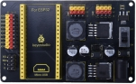         | Keyestudio ESP32舵机驱动板 环保              | 1    |
| 2    |         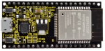         | keyestudio ESP32 Core board 黑色 环保        | 1    |
| 3    |         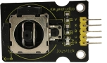         | Keyestudio Joystick Module-摇杆模块          | 2    |
| 4    |         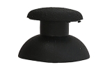         | 3D PS2 蘑菇头环保                            | 2    |
| 5    |         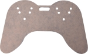         | MeArm亚克力手柄 黑色不透明 T=3MM 环保        | 1    |
| 6    |         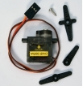         | MG90S 14G 黑色透明 180度 金属齿轮            | 3    |
| 7    |         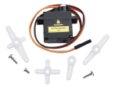         | Keyestudio 9G 舵机 黑色 180度数字 带卡位     | 1    |
| 8    |         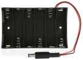         | 6节5号带线15CM露线 带DC插杆 环保             | 1    |
| 9    | 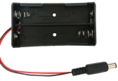 | 2节18650电池盒（推荐使用尖头的18650电池）    | 1    |
| 10   |        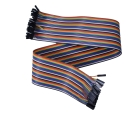         | 母对母50CM/10P/2.54/10股铜包铝 24号线BL      | 1    |
| 11   |        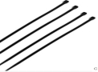         | 扎带 黑色 3*100MM                            | 7    |
| 12   |        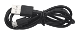         | Micro USB线                                  | 1    |
| 13   |                 | 3 pin 公对母杜邦线 (黑-红-白)  长20CM        | 1    |
| 14   |                 | 3*40MM 十字螺丝刀 手柄颜色黄黑               | 1    |
| 15   |                 | M2+M3 小扳手                                 | 1    |
| 16   |        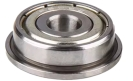         | F693ZZ 内径:3MM  外径:8MM 厚:4MM 电机级      | 3    |
| 17   |        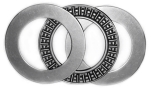         | 内径20mm；外径35mm；高4mm AXK三片式 平面轴承 | 1    |
| 18   |        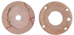         | 轴承上盖+轴承下盖 挖槽 无色透明              | 1    |
| 19   |        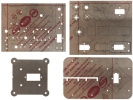         | 亚克力板 4片 黑色不透明  环保                | 1    |
| 20   |        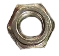         | M3 镀镍 环保                                 | 14   |
| 21   |                 | M2 镀镍                                      | 4    |
| 22   |        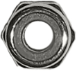         | M3 镀镍 自锁                                 | 8    |
| 23   |        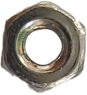         | M2.5 镀镍                                    | 8    |
| 24   |        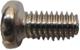         | M3*6MM 圆头 十字                             | 4    |
| 25   |        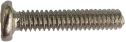         | M2*10MM 圆头 十字                            | 4    |
| 26   |        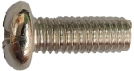         | M3*8MM 圆头 十字                             | 4    |
| 27   |                 | M1.2*5MM 圆头 十字 自攻 螺丝头2.54MM         | 2    |
| 28   |        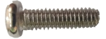         | M3*10MM 圆头 十字                            | 3    |
| 29   |        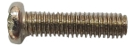         | M3*12MM 圆头 十字                            | 5    |
| 30   |        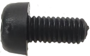         | M3*6MM 圆头十字 黑色 环保                    | 8    |
| 31   |                 | M3*16mm双通尼龙柱 黑色                       | 2    |
| 32   |                 | M3*22mm双通尼龙柱 黑色                       | 2    |
| 33   |        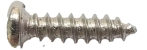         | M2*8MM 圆头 自攻 十字                        | 4    |
| 34   |        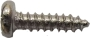         | M1.2*4MM 圆头 十字 自攻 螺丝头2.54MM         | 4    |
| 35   |        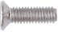         | M3*8MM 平头 十字                             | 2    |
| 36   |        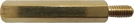         | M2.5*25+6MM 单通                             | 8    |
| 37   |        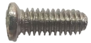         | M2.5*6MM 圆头 十字4                          | 8    |
| 38   |        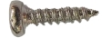         | M1.4*6MM 圆头 十字 自攻                      | 4    |
| 39   |        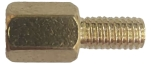         | M3*6+6MM 单通                                | 6    |
| 40   |        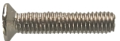         | M3*14MM 平头 十字                            | 2    |


## 2.简介

基于ESP32控制板，我们设计了一个完整的套件，其中包括构建可编程机器人手臂所需的硬件和工具。在我们提供的教程中，您可以使用操纵杆控制它，也可以使用与我们的ESP32板连接到同一wifi的手机或计算机控制它。它可以伸手、抓取、捡起和移动小物体，并且具有记忆功能，可以重复您设置的动作。
	这是初学者学习ESP32板和伺服系统的理想制造商项目。

## 3.参数

  工作电压：3.3~5V

DC输入电压：7~12V

电池盒：6节AA电池盒或两节18650电池盒（电池自备）

自由度：4个自由度

## 4.特点

**灵活性：**机械臂具有4个自由度，可以在多个方向上移动和旋转，能够执行各种复杂的动作和任务。

**控制方便：**采用ESP32微控制器作为控制核心，具有丰富的接口和通信功能，方便与其他设备或系统进行通信和控制。

**编程灵活性：**通过编程控制，可以实现机械臂的自动化操作，例如运动轨迹规划、物体抓取和放置等功能。

**开放性和可扩展性**：ESP32平台具有开放的生态系统，用户可以根据自己的需求进行定制和扩展，添加传感器、执行器或其他附加功能，实现更多的应用场景。

## 5.KEYESTUDIO ESP32主板介绍

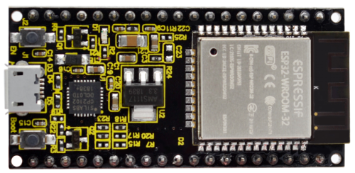

### 5.1 简介

keyestudio ESP32 Core board 是基于ESP-WROOM-32模块所设计的的迷你开发板。该开发板引出大部分I/O至两侧的2.54mm间距的排针，开发者可以根据自己的需求连接外设。使用开发板进行开发和调试时，两侧的标准排针可以让你的操作更加简洁方便。

  ESP-WROOM-32模块是业内集成度领先的 WiFi + 蓝牙解决方案，外部元器件少于 10 个，它集成了天线开关、射频 balun、功率放大器、低噪放大器、过滤器和电源管理模块。同时，采用 TSMC 低功耗 40nm 技术，功耗性能和射频性能，安全可靠，易于扩展至各种应用。

### 5.2 参数

Microcontroller: ESP-WROOM-32模块

USB转串口芯片:CP2102-GMR

工作电压:DC 5V

工作电流：80mA（平均）

供电电流：500mA（最小）

工作温度范围: -40°C ~ +85°C 

WiFi模式：Station/SoftAP/SoftAP+Station/P2P

WiFi协议：802.11 b/g/n/e/i（802.11n，速度高达 150 Mbps）

WiFi频率范围：2.4 GHz ~ 2.5 GHz

蓝牙协议：符合蓝牙 v4.2 BR/EDR 和 BLE 标准

尺寸：55x26x13mm

重量：9.3g

### 5.3 引脚详细说明

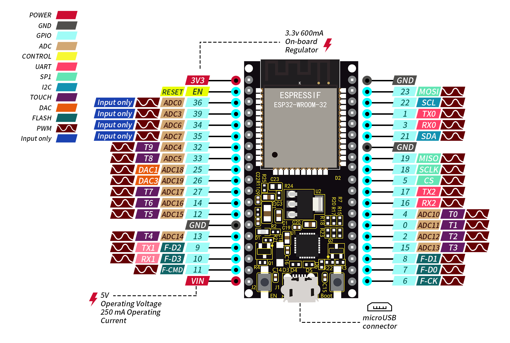

虽然ESP32的引脚数比常用的处理器少，但在引脚上复用多个功能时不会遇到任何问题，IO36，IO35，IO34，IO39只能作为输入脚。
**警告**：ESP32引脚的电压电平为3.3V。如果要将ESP32连接到其他工作电压为5V的设备，则应使用电平转换器转换电压电平。

● **电源引脚**：该模块有两个电源引脚+5V和3.3V。你可以使用这两个引脚来向其他设备和模块供电。

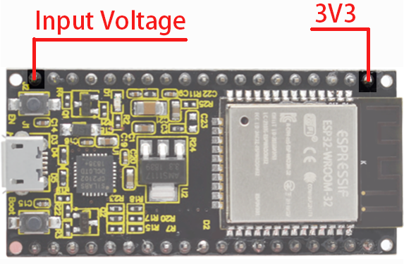

● **GND引脚**：该模块的接地有3个引脚。

● **启用引脚（EN）**：该引脚用于启用和禁用模块。引脚为高电平时启用模块，低电平禁用模块。

● **输入/输出引脚（GPIO）**：您可以使用32个GPIO引脚与LED、开关和其他输入/输出设备进行通信。
您可以在内部上拉或下拉这些引脚。
**注意：GPIO6至GPIO11引脚（SCK/CLK，SDO/SD0，SDI/SD1，SHD/SD2，SWP/SD3和SCS/CMD引脚）用于模块内部闪存的SPI通信，我们不建议使用它们。**

● **ADC**：您可以使用此模块上的16个ADC引脚将模拟电压（某些传感器的输出）转换为数字电压。其中一些转换器连接到内部放大器，能够以高精度测量小电压。

● **DAC**：ESP32模块有两个数模转换器，精度为8位。

● **触摸焊盘**：ESP32模块上有10个引脚，对电容变化很敏感。您可以将这些引脚连接到某些焊盘（PCB上的焊盘），并将它们用作触摸开关。

● **SPI**：该模块上有两个SPI接口，可用于连接显示屏、SD / microSD存储卡模块、外部闪存等。

● **I2C**：SDA和SCL引脚用于I2C通信。

● **串行通信（UART）：**该模块上有两个UART串行接口。使用这些引脚，您可以在两个设备之间传输高达5Mbps的信息。 UART0还具有CTS和RTS控制。

● **PWM**：几乎所有ESP32输入/输出引脚都可用于PWM（脉冲宽度调制)。使用这些引脚可以控制电机、LED灯和颜色等。

### 5.4 主要部位说明:

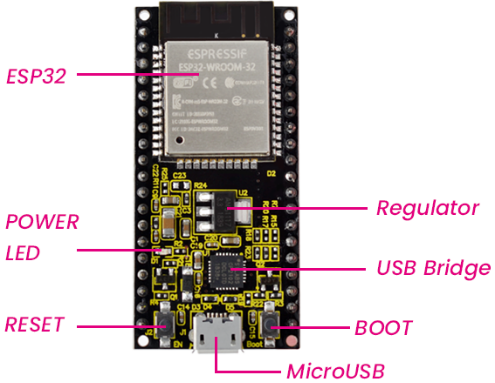

## 6. ESP32舵机驱动板介绍

### 6.1简介

KEYESTUDIO ESP32舵机驱动板拥有6个舵机驱动口（5V）以及9个IO口（3.3V），两个IIC接口（3.3V），舵机驱动采用两个LM2596S-5.0V 3A大电流电源IC给舵机提供工作电压。然后由1117 3.3V给9个的IO口与IIC口供电。 

### 6.2 参数

外接电源：7-12V

舵机接口电压：5V

IO口电压：3.3V

尺寸：90x55x15.5mm

重量：41g（裸板）

### 6.3 引脚接口说明图


### 6.4 原理图

[点击链接下载原理图PDF文件](./schematic_diagram.pdf)

## 7.Arduino IDE基础教程

### 7.1下载并安装Arduino IDE

您可以从官方网站下载最新的Arduino IDE：https://www.arduino.cc/en/software
	有适用于Windows、Mac和Linux系统的版本。
	在这里，我们将选择Windows版本，向您展示如何下载、安装和使用它。您可以在安装程序（.exe）和Zip包之间进行选择。我们建议您使用第一个，它可以直接安装使用Arduino软件（IDE）所需的所有内容，包括驱动程序。使用Zip软件包，您需要手动安装驱动程序。如果您想创建便携式安装，Zip文件也很有用。


- 1.在下载选项中选择Win 10及更高版本，64位。
  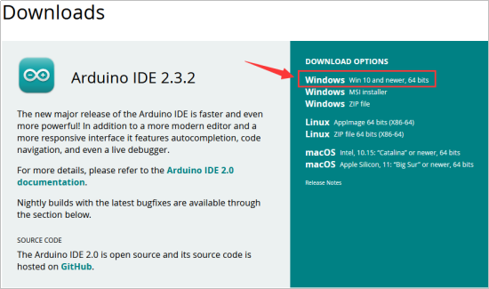
- 2.点击 JUST DOWNLOAD
  
- 3.加入时事通讯，或者只需点击“JUST DOWNLOAD”即可
  


- 4.将从软件页面下载的.exe文件保存到硬盘，然后简单地运行该文件。
  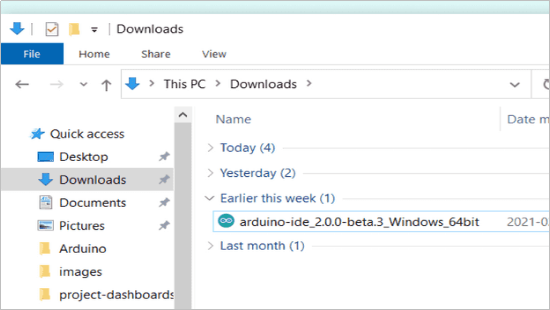
- 5.阅读并同意许可协议。
  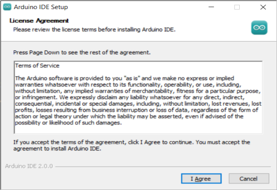
- 6.选择安装选项。
  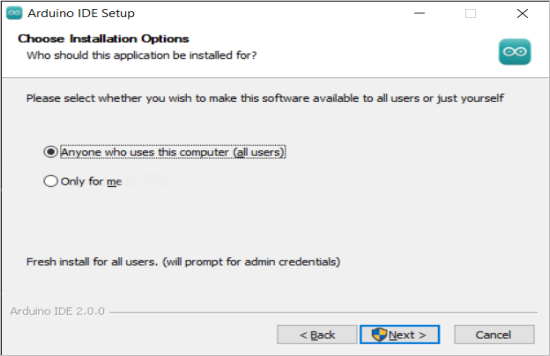
- 7.选择安装位置。
  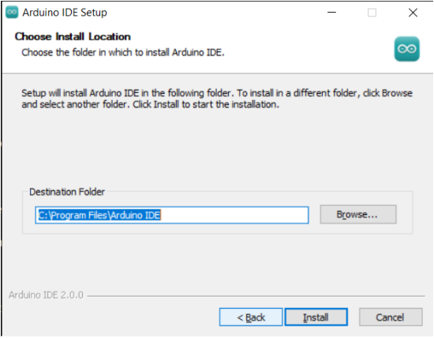
- 8.此外，安全中心可能会弹出几次询问您是否要安装某些设备驱动程序。请全部安装。
  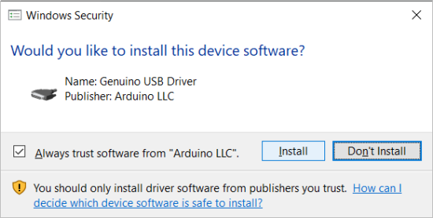
- 9.点击完成并运行Arduino IDE
  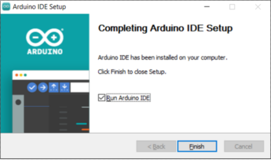
- 10.防火墙会询问我们是否要允许访问，只需单击允许访问即可。
  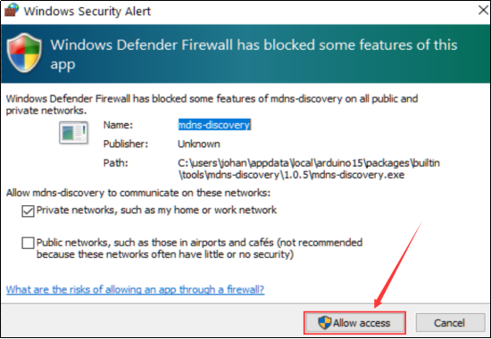
- 10.防火墙会询问我们是否要允许访问，只需单击允许访问即可。
  11.等待一段时间，让arduino IDE自动安装arduino AVR板、内置库和其他所需文件。
  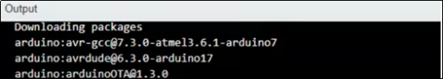

---

### 7.2 Arduino IDE 2.0 简介

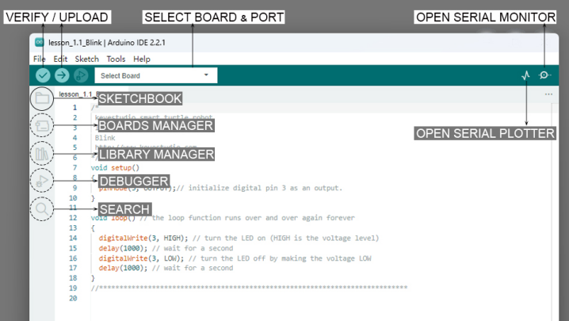

**验证/上传**-编译代码并将其上传到Arduino板。

**选择板和端口**-检测到的Arduino板会自动显示在此处，并显示端口号。
**Sketchbook**-在这里，您可以找到本地存储在计算机上的所有草图。此外，您可以与Arduino Cloud同步，也可以从在线环境中获取草图。
**Boards Manager**-浏览可以安装的Arduino和第三方软件包。例如，使用MKR WiFi 1010板需要安装Arduino SAMD Boards软件包。
**库管理器**-浏览Arduino及其社区制作的数千个Arduino库。
**调试器**-实时测试和调试程序。
**搜索**-在代码中搜索关键字。
**打开串行监视器**-打开串行监视器工具，作为控制台中的新选项卡。
如果您想了解更多关于Arduino IDE的信息，请参阅此文档：

**Verify / Upload** - 编译代码并将其上传到Arduino板。.

**Select Board & Port** - 检测到的Arduino板会自动显示在此处，并显示端口号。

**Sketchbook** - 在这里，您可以找到本地存储在计算机上的所有草图。此外，您可以与Arduino Cloud同步，也可以从在线环境中获取草图。

**Boards Manager** - 浏览可以安装的Arduino和第三方软件包。例如，使用MKR WiFi 1010板需要安装Arduino SAMD Boards软件包。

**Library Manager** - 浏览Arduino及其社区制作的数千个Arduino库。

**Debugger** - 实时测试和调试程序。

**Search** -在代码中搜索关键字。

**Open Serial Monitor** - 打开串行监视器工具，作为控制台中的新选项卡。
如果您想了解更多关于Arduino IDE的信息，请参阅此文档：[**Arduino IDE**](https://docs.arduino.cc/software/ide-v2/tutorials/getting-started-ide-v2/)

---

### 7.3 安装ESP32板的驱动程序

ESP32板的USB转串口芯片是CP2102-GMR。
用usb电缆将ESP32板连接到计算机，等待Windows开始其驱动程序安装过程。使用Arduino时，CP2102驱动程序通常会由您的系统自动安装。您可以检查设备管理器或Arduino IDE的端口，查看驱动程序是否已成功安装。
右键单击**“我的电脑”**并选择**控制面板**，打开**设备管理器**。
查看**端口（COM和LPT）**。您应该看到一个名为**Silicon Labs CP210x USB到UART桥（COM-X）的开放端口**
在Arduino IDE中点击**工具>端口**，您可以找到设备管理器显示的com端口
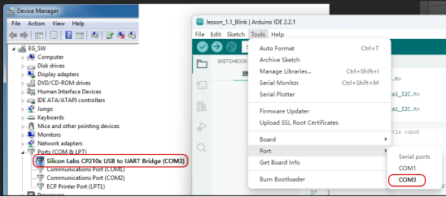

如果**安装过程失败**，您应该看到一个旁边有一个黄色小三角形和感叹号的设备。
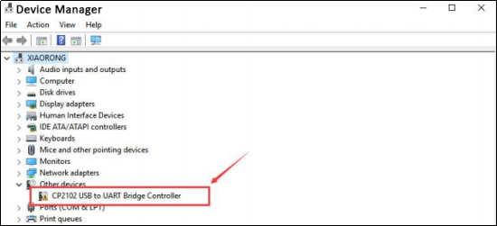

**现在让我们手动安装CP210x芯片驱动程序。**

1. 在我们下载的教程包中(https://fs.keyestudio.com/FKS0003)，您可以找到CP210x_6.7.4驱动程序文件。

   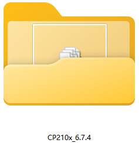

2. 右键单击**“CP210x USB到UART桥控制器”**，然后选择**“更新驱动程序软件”**选项。
   

3. 选择**“浏览我的计算机以查找驱动程序软件”**选项。
   

4. 选择我们下载的教程包中名为**“CP210x_6.7.4”**的驱动程序文件。
   

5. 一段时间后，驱动程序安装成功。
   


### 7.4在Arduino中配置ESP32环境

<p style="color:red;">注意：建议安装2.0.12版本的ESP32开发板，因为我们开发这个机械手臂使用的就是这个版本的ESP32，如果使用其他版本的可能存在不兼容情况。</p>

如果你是Windows系统的电脑这里有个更简单的安装ESP32的方法，点击链接下载`esp32_package_2.0.12_arduinome.exe`，然后双击运行等待自动安装成功再打开Arduino IDE即可看到ESP32：


等待其安装过程完成


`esp32_package_2.0.12_arduinome.exe`下载链接：[https://fs.keyestudio.com/ESP32](https://fs.keyestudio.com/ESP32)

安装完成后，在Arduino IDE的BOARDS MANAGER中键入ESP32，您将在Arduino中看到ESP32环境：2.0.12（Espressif Systems的ESP32）


### 7.5上传你的第一张草图。

<p style="font-size:18px;color:red;">现在，让我们开始我们的第一个编程项目，将伺服角度调整到90°</p>

1.您需要准备一个伺服系统、一个EPS32板、一个ESP32屏蔽和一根USB电缆。


2.接线：

| 伺服驱动板 | 舵机  |
| :--------: | :---: |
|  IO17(黄)  | S(黄) |
|   5V(红)   | V(红) |
|  GND(黑)   | G(黑) |

<p style="font-size:18px;color:red;">注意EPS32板的安装方向。反向安装可能会烧坏它。</p>


3.使用USB电缆将ESP32板连接到计算机。
	选择板类型**“ESP32开发模块”**


4.选择端口COM-4（这取决于您的计算机分配给ESP32板的编号，您可以在设备管理器中查看该编号）。


5.在上传代码之前，请将“ESP32Servo”库导入Arduino IDE，以避免编译失败。

 <p style="color:red">库文件版本必须为1.2.1，否则还会报告错误。如何导入“ESP32Servo”库：</p>

<p style=“color:red”>库文件版本必须为1.2.1，否则还会报告错误。如何导入“ESP32Servo”库：</p>
-[]单击Arduino IDE左上角的**LIBRARY MANAGER**按钮。

-[]在搜索框中输入**“ESP32servo”**。

-[]选择**“ESP32servo”**库的1.2.1版本。

-[]点击**INTALL**。


6.将以下代码复制到Arduino IDE中，然后单击上传。

```python
/*
  Keyestudio ESP32 Robot Arm
  8-6 Servo Configuration
  Function: set servo at pin IO17 to the angle of 90°
  http://www.keyestudio.com
*/
#include <ESP32Servo.h>

// create a servo objects ，Customizable name
Servo servo;
int servoPin = 17; //Connect servo to pin IO17

void setup()
{ 
  servo.attach(servoPin);  
  servo.write(0);  //Set servo angle to 0°
  delay(1000);
  servo.write(180);  //Set servo angle to 180°
  delay(1000);   
  servo.write(90);  //Set servo angle to 90°
}

void loop() {
}
```

上传代码后，伺服系统将首先初始化为0°。然后它从0旋转到180°，然后保持在90°。安装前，我们需要确保伺服系统处于90°位置。


## 8.安装教程

### 8.1 电池盒的组装及拆卸

#### 8.1.1组装电池盒

8.1.1.1 六节AA电池盒

清单：


组装步骤：


8.1.1.2两节18650电池盒

清单：

-1.png)

组装步骤：

-2.png)

-3.png)

8.1.2拆卸电池盒

**六节AA电池盒更换电池教程**


**两节18650电池盒更换电池教程**

-4.png)


-5.png)


-6.png)


-7.png)

-8.png)


-9.png)


### 8.2 组装扩展板与ESP32开发板

清单：


组装步骤：


### 8.3 组装舵机底座

清单：


组装步骤：


### 8.4 组装机械手臂底座与轴承底座与底座舵机

清单：


组装步骤：

<p style="color:red">注意绿色圈标记的缺口位置</p>


<p style="color:red">注意绿色圈标记的缺口位置</p>


### 8.5 组装机械手臂与底座衔接的平台

清单：


组装步骤：


### 8.6 组装大臂右侧结构和大臂舵机

清单：


组装步骤：


<p style="font-size:25px;color:red;">注意：给舵机设置角度这一步很重要，一定要做否则将会损坏舵机。</p>

接线表与接线图：

|  舵机驱动板  |   舵机    |
| :----------: | :-------: |
| IO17（黄色） | S（黄色） |
|  5V（红色）  | V（红色） |
| GND（黑色）  | G（棕色） |


代码：

使用Arduino IDE直接从教程包中打开此代码。


<p style="color:red">注意：需要将“ESP32Servo”库文件添加到Arduino IDE否则将会上传代码失败,版本一定要1.2.1否则也将会报错，参考下图添加"ESP32Servo"库文件：</p>


```c
/*
  Keyestudio ESP32机械手臂
  8-6 组装设置舵机代码
  代码功能：将IO17引脚连接的舵机角度设置成90°
  http://www.keyestudio.com
*/
#include <ESP32Servo.h>

// create a servo objects ，Customizable name
Servo servo;
int servoPin = 17; //定义IO17脚为舵机控制脚

void setup()
{ 
  servo.attach(servoPin);  
  servo.write(0);  //设置舵机角度为90度
  delay(1000);
  servo.write(180);  //设置舵机角度为90度
  delay(1000);   
  servo.write(90);  //设置舵机角度为90度
}

void loop() {
}
```

上传代码成功后舵机会先转到0度然后从0度转到180度，再转到90度并保持，我们需要在舵机为90度时进行后续安装。

如图竖直安装


### 8.7 组装小臂右侧结构

清单：


组装步骤：


### 8.8 组装大臂与小臂左侧结构和小臂舵机

清单：


组装步骤：


<p style="font-size:25px;color:red;">注意：给舵机设置角度这一步很重要，一定要做否则将会损坏舵机。</p>

接线表与接线图：

| 舵机驱动板  |   舵机    |
| :---------: | :-------: |
| IO2（黄色） | S（黄色） |
| 5V（红色）  | V（红色） |
| GND（黑色） | G（棕色） |


代码：

使用Arduino IDE直接从教程包中打开此代码。


或者，您可以将下面的代码复制并粘贴到Arduino IDE中

```c
/*
  Keyestudio ESP32机械手臂
  8-8 组装设置舵机代码
  代码功能：将IO2引脚连接的舵机角度设置成90°
  http://www.keyestudio.com
*/
#include <ESP32Servo.h>

// create a servo objects ，Customizable name
Servo servo;
int servoPin = 2; //定义IO2脚为舵机控制脚

void setup()
{ 
  servo.attach(servoPin); 
  servo.write(0);  //设置舵机角度为90度
  delay(1000);
  servo.write(180);  //设置舵机角度为90度
  delay(1000);   
  servo.write(90);  //设置舵机角度为90度
}

void loop() {
}
```

上传代码成功后舵机会先转到0度然后从0度转到180度，在转到90 度并保持，我们需要在舵机为90度时进行后续安装。

<p style="color:red">注意：两个箭头标记的，小臂结构件安装的斜度应该与大臂上的斜线保持在一个水平上。</p>


### 8.9 组装爪子底座与舵机

清单：


组装步骤：


### 8.10 组装爪子

清单：


组装步骤：


<p style="font-size:25px;color:red;">注意：给舵机设置角度这一步很重要，一定要做否则将会损坏舵机。</p>

接线表与接线图：

| 舵机驱动板  |   舵机    |
| :---------: | :-------: |
| IO4（黄色） | S（黄色） |
| 5V（红色）  | V（红色） |
| GND（黑色） | G（棕色） |


代码：

使用Arduino IDE直接从教程包中打开此代码。


或者，您可以将下面的代码复制并粘贴到Arduino IDE中

```c
/*
  Keyestudio ESP32机械手臂
  8-10 组装设置舵机代码
  代码功能：将IO4引脚连接的舵机角度设置成90°
  http://www.keyestudio.com
*/
#include <ESP32Servo.h>

// create a servo objects ，Customizable name
Servo servo;
int servoPin = 4; //定义IO4脚为舵机控制脚

void setup()
{ 
  servo.attach(servoPin);
  servo.write(0);  //设置舵机角度为90度
  delay(1000);
  servo.write(180);  //设置舵机角度为90度
  delay(1000);   
  servo.write(90);  //设置舵机角度为90度
}

void loop() {
}
```

上传代码成功后舵机会先转到0度然后从0度转到180度，再转到90度并保持，我们需要在舵机为90度时进行后续安装。


### 8.11 组装机械手臂中间结构

清单：


组装步骤：


### 8.12 组装底座与轴承

清单：


组装步骤：


<p style="font-size:25px;color:red;">注意：给舵机设置角度这一步很重要，一定要做否则将会损坏舵机。</p>

接线表与接线图：

|  舵机驱动板  |   舵机    |
| :----------: | :-------: |
| IO16（黄色） | S（黄色） |
|  5V（红色）  | V（红色） |
| GND（黑色）  | G（棕色） |


代码：

使用Arduino IDE直接从教程包中打开此代码。


或者，您可以将下面的代码复制并粘贴到Arduino IDE中

```c
/*
  Keyestudio ESP32机械手臂
  8-12 组装设置舵机代码
  代码功能：将IO16引脚连接的舵机角度设置成90°
  http://www.keyestudio.com
*/
#include <ESP32Servo.h>

// create a servo objects ，Customizable name
Servo servo;
int servoPin = 16; //定义IO16脚为舵机控制脚

void setup()
{ 
  servo.attach(servoPin); 
  servo.write(0);  //设置舵机角度为90度
  delay(1000);
  servo.write(180);  //设置舵机角度为90度
  delay(1000);   
  servo.write(90);  //设置舵机角度为90度
}

void loop() {
}
```

上传代码成功后舵机会先转到0度然后从0度转到180度，在转到90 度并保持，我们需要在舵机为90度是进行后续安装。

<p style="color:red">注意绿圈内缺口位置</p>


### 8.13 组装机械手臂到底板


### 8.14 组装手柄

清单：


组装步骤：


### 8.15 接线

舵机接线：

根据图片部位示意图将对应部位的舵机接到对应的IO口上（接线与各个舵机设置角度的接线一致）


<p style="color:red;">注意：爪子部分的舵机由于需要的接线较长所以使用3Pin的杜邦线转接</p>


手柄接线：

|  舵机驱动板  | 遥杆模块（左边遥杆） |
| :----------: | :------------------: |
|  5V（红色）  |          V           |
| GND（黑色）  |          G           |
| IO12（黄色） |          B           |
| IO13（黄色） |          X           |
| IO15（黄色） |          Y           |
|              |                      |

|  舵机驱动板  | 遥杆模块（右边遥杆） |
| :----------: | :------------------: |
|  5V（红色）  |          V           |
| GND（黑色）  |          G           |
| IO25（黄色） |          B           |
| IO33（黄色） |          X           |
| IO32（黄色） |          Y           |
|              |                      |


## 9.机械手臂教程

### 9.1 如何控制舵机

**9.1.1 舵机介绍**

舵机是一种位置伺服的驱动器，主要是由外壳、电路板、无核心马达、齿轮与位置检测器所构成。其工作原理是由接收机或者单片机发出信号给舵机，其内部有一个基准电路，产生周期为20ms，宽度为1.5ms 的基准信号，将获得的直流偏置电压与电位器的电压比较，获得电压差输出。

舵机有很多规格，但所有的舵机都有外接三根线，分别用棕、红、橙三种颜色进行区分，由于舵机品牌不同，颜色也会有所差异，棕色为接地线，红色为电源正极线，橙色为信号线。


**9.1.2 舵机参数**

工作电压：DC 4.8V〜6V

尺寸：32.2x12x33.3mm   

扭力：2.0kg(4.8v)    

速度：0.11s(4.8v)   

转动角度：最大180°

脉波宽度范围：500→2500 μsec

舵机类型：模拟舵机       

使用温度：0°-55°      

 死区设定：5微秒  

结构材质：金属铜齿、空心杯电机、双滚珠轴承

**9.1.3 控制原理**

舵机的转动的角度是通过调节PWM（脉冲宽度调制）信号的占空比来实现的，标准PWM（脉冲宽度调制）信号的周期固定为20ms（50Hz），理论上脉宽分布应在1ms到2ms 之间，但是，事实上脉宽可由0.5ms 到2.5ms 之间，脉宽和舵机的转角0°～180°相对应。


对应的舵机角度值如下:


**9.1.4 接线图**

<p style="color:red;">接线注意：舵机连接到G（GND）、V（VCC）、IO16，舵机的棕色线是与Gnd(G)相连，红色线与5v(V)相连，橙色线是与IO16相连的。接舵机的时候必须要外接供电，因为驱动舵机的电流要求比较大，开发板的电流远远不够。</p>

|  舵机驱动板  |   舵机    |
| :----------: | :-------: |
| IO16（黄色） | S（黄色） |
|  5V（红色）  | V（红色） |
| GND（黑色）  | G（棕色） |


**9.1.5 代码**

在上传代码之前，请将“ESP32Servo”库导入Arduino IDE，以避免编译失败。

<p style="color:red">库文件版本必须为1.2.1，否则还会报告错误。如何导入“ESP32Servo”库：</p>


- [ ] 单击Arduino IDE左上角的**LIBRARY MANAGER**按钮。
- [ ] 在搜索框中输入**“ESP32servo”**。
- [ ] 选择**“ESP32servo”**库的1.2.1版本。
- [ ] 点击**INTALL** it.


使用Arduino IDE直接从教程包中打开此代码。


或者，您可以将下面的代码复制并粘贴到Arduino IDE中。

```c
/*
  Keyestudio ESP32机械手臂
  9-1-5教程代码
  代码功能：控制舵机旋转到0度，90度，180度
  http://www.keyestudio.com
*/
#include <ESP32Servo.h>

// create a servo objects ，Customizable name
Servo servo;
int servoPin = 16; //定义IO16脚为舵机控制脚

void setup()
{ 
  servo.attach(servoPin);   
}

void loop() {
    servo.write(0);  //设置舵机角度为0度
    delay(1000);	//延时一秒
    servo.write(90);  //设置舵机角度为90度
    delay(1000);
    servo.write(180);  //设置舵机角度为180度
    delay(1000);
}
```

**9.1.6 代码结果**

上传代码成功后，我们将看到舵机会由0度延时1S后旋转到90度再延时1S后旋转到180度延时1S，然后回到0度重复上述动作。


### 9.2 如何读取遥杆的模拟值

 **9.2.1 遥杆模块介绍**

遥杆模块采用PS2 手柄摇杆元件。控制时，我们需要将模块X Y端口连接单片机模拟口，B端口连接单片机数字口，VCC接单片机电源输出端（3.3-5V），GND接单片机GND。我们可以读取两个模拟值和一个数字口的高低电平情况，判断模块上摇杆的工作状态。

**9.2.2 遥杆参数**

工作电压：3.3V~5V

三轴：X，Y，Z

尺寸：44.2x28x32.8mm

 **9.2.3 原理**

遥杆模块原理其实很简单，X和Y轴其实是两个电位器，如下图遥杆往上Y轴的模拟值会减小直到为0，往下Y轴的模拟值会增加直到4095（ESP32的模拟值范围为0~4095），同理X轴也一样往左模拟值减小，往右模拟值增加。


Y轴往上之所以模拟值会减小，是因为往上时Y轴的输出引脚对地的电阻在减少，所以模拟值也在减小，往下时就是对地的电阻在增加所以模拟值也增加，X轴也是一样，只不过就是变成了左右。


 **9.2.4 读取手柄遥杆值**

将两个遥杆传感器连接到ESP32舵机驱动板，然后将值进行读取并通过串口打印

使用Arduino IDE直接从教程包中打开此代码。


或者将以下代码复制到Arduino IDE中，然后单击上传。

```c
/*
  Keyestudio ESP32 Robot Arm
  9-2-4 tutorial code
  Function: 
  http://www.keyestudio.com
*/
//Define the left remote rod pin
#define left_B 12  
#define left_X 13
#define left_Y 15
//Define the right remote rod pin
#define right_B 25
#define right_X 33
#define right_Y 32
//Define variables for storing remote sensing values
int left_B_data, left_Y_data, left_X_data, right_B_data, right_X_data, right_Y_data;  

void setup() {
  // put your setup code here, to run once:
  Serial.begin(9600);
  pinMode(left_B, INPUT);   //Set pins to input mode
  pinMode(left_X, INPUT);
  pinMode(left_Y, INPUT);
  pinMode(right_B, INPUT);
  pinMode(right_X, INPUT);
  pinMode(right_Y, INPUT);
}
void loop() {
  // put your main code here, to run repeatedly:
  left_B_data = digitalRead(left_B);    
  left_X_data = analogRead(left_X);
  left_Y_data = analogRead(left_Y);

  right_B_data = digitalRead(right_B);
  right_X_data = analogRead(right_X);
  right_Y_data = analogRead(right_Y);

  Serial.print(" left B:");
  Serial.print(left_B_data);
  Serial.print("    left X:");
  Serial.print(left_X_data);
  Serial.print("    left Y:");
  Serial.println(left_Y_data);
  
  Serial.print("right B:");
  Serial.print(right_B_data);
  Serial.print("   right X:");
  Serial.print(right_X_data);
  Serial.print("   right Y:");
  Serial.println(right_Y_data);
  delay(300);
}

```


 **9.2.7.3 代码结果**

上传代码后，打开**串口监视器**，将串口波特率设置为**9600**，您将在上面看到打印的遥控值。如果您觉得串口打印速度太快，可以增加delay() 括号中的值。


### 9.3 遥杆控制机械手臂

 **9.3.1 遥杆控制机械手臂简介**

ESP32开发板通过舵机驱动板与遥杆模块进行连接，并读取遥杆模块的XY轴的值然后判断舵机应该旋转的角度多少，这样就可以使用遥杆都机械手臂进行控制了。

 **9.3.2 流程图**


 **9.3.3 代码**

使用Arduino IDE直接从教程包中打开此代码。


或者，您可以将下面的代码复制并粘贴到Arduino IDE中。

```c
/*
  Keyestudio ESP32机械手臂
  9-3-3教程代码
  代码功能：使用遥杆手臂控制机械手臂
  http://www.keyestudio.com
*/
#include "ESP32Servo.h"
Servo base;  // create servo object to control a servo
Servo arm;
Servo forearm;
Servo gripper;
//定义舵机控制引脚
#define basePin 16
#define armPin 17
#define forearmPin 2
#define gripperPin 4
//定义左边遥杆
#define left_B 12
#define left_X 13
#define left_Y 15
//定义右边遥杆
#define right_B 25
#define right_X 33
#define right_Y 32
int left_B_data, left_Y_data, left_X_data, right_B_data, right_X_data, right_Y_data;
//舵机
int baseAngle = 90;     // 上一次底座舵机角度
int armAngle = 90;       // 上一次大臂舵机角度
int forearmAngle = 90;  // 上一次小臂舵机角度
int gripperAngle = 90;  // 上一次爪子舵机角度

void setup() {
  // put your setup code here, to run once:
  Serial.begin(9600);
  pinMode(left_B, INPUT);
  pinMode(left_X, INPUT);
  pinMode(left_Y, INPUT);
  pinMode(right_B, INPUT);
  pinMode(right_X, INPUT);
  pinMode(right_Y, INPUT);

  base.attach(basePin);  // attaches the servo on pin 16 to the servo object
  arm.attach(armPin);
  forearm.attach(forearmPin);
  gripper.attach(gripperPin);

  base.write(baseAngle);
  arm.write(armAngle);
  forearm.write(forearmAngle);
  gripper.write(gripperAngle);
}

void loop() {
  // put your main code here, to run repeatedly:
  left_B_data = digitalRead(left_B);
  left_X_data = analogRead(left_X);
  left_Y_data = analogRead(left_Y);

  right_B_data = digitalRead(right_B);
  right_X_data = analogRead(right_X);
  right_Y_data = analogRead(right_Y);

  baseControl();
  armControl();
  forearmControl();
  gripperControl();
}

//底座控制
void baseControl() {
  if (left_X_data > 3000) {
    while (analogRead(left_X) > 3000) {
      base.write(baseAngle++);
      if (baseAngle >= 180) baseAngle = 180;
      delay(10);
    }
  } else if (left_X_data < 20) {
    while (analogRead(left_X) < 20) {
      base.write(baseAngle--);
      if (baseAngle <= 0) baseAngle = 0;
      delay(10);
    }
  }
}

//大臂控制
void armControl() {
  if (left_Y_data > 3000) {
    while (analogRead(left_Y) > 3000) {
      arm.write(armAngle++);
      if (armAngle >= 180) armAngle = 180;
      delay(10);
    }
  } else if (left_Y_data < 20) {
    while (analogRead(left_Y) < 20) {
      arm.write(armAngle--);
      if (armAngle <= 80) armAngle = 80;
      delay(10);
    }
  }
}

//小臂控制
void forearmControl() {
  if (right_Y_data < 20) {           
    while (analogRead(right_Y) < 20) {
      forearm.write(forearmAngle++);
      if (forearmAngle >= 120) forearmAngle = 120;
      delay(10);
    }
  } else if (right_Y_data > 3000) {
    while (analogRead(right_Y) > 3000) {
      forearm.write(forearmAngle--);
      if (forearmAngle <= 30) forearmAngle = 30;
      delay(10);
    }
  }
}

//爪子控制
void gripperControl() {
  if (right_X_data > 3000) {
    while (analogRead(right_X) > 3000) {
      gripper.write(gripperAngle++);
      if (gripperAngle >= 150) gripperAngle = 150;
      delay(10);
      // gripper.write(180);
    }
  } else if (right_X_data < 20) {
    while (analogRead(right_X) < 20) {
      // gripper.write(80);
      gripper.write(gripperAngle--);
      if (gripperAngle <= 80) gripperAngle = 80;
      delay(10);
    }
  }
}

```

**9.3.4 代码结果**

上传代码后，就可以使用手柄控制了。左边遥杆X轴控制整个机械手臂旋转（X < 20右转，X > 3000左转），Y轴控制大臂抬起与放下（Y < 20大臂抬起，Y > 3000大臂放下），右边遥杆X轴控制夹子打开与闭合（X < 20爪子闭合，X > 3000爪子打开），Y轴控制小臂的抬起与放下（Y < 20小臂抬起，Y > 3000小臂放下）。（注意：遥杆往上推也就是Y轴往上是抬起，往下是放下，大臂小臂都是如此）


**9.3.5 添加记忆功能**

通过右侧遥杆上的按键进行存储当前舵机的角度，可以连续存储10次角度，然后通过左侧遥杆上的按键进行进入动作回放。

**9.3.5.1 代码流程图**


**9.3.5.2 代码**

使用Arduino IDE直接从教程包中打开此代码。


或者，您可以将下面的代码复制并粘贴到Arduino IDE中。

```c
/*
  Keyestudio ESP32机械手臂
  9-3-5 教程代码
  代码功能：使用遥杆手柄控制机械手臂利用遥杆的Z轴按键存储舵机的角度与回放存储好的角度
  http://www.keyestudio.com
*/
#include "ESP32Servo.h"
Servo base;  // create servo object to control a servo
Servo arm;
Servo forearm;
Servo gripper;
//定义舵机控制引脚
#define basePin 16
#define armPin 17
#define forearmPin 2
#define gripperPin 4
//定义左边遥杆
#define left_B 12
#define left_X 13
#define left_Y 15
//定义右边遥杆
#define right_B 25
#define right_X 33
#define right_Y 32
int left_B_data, left_Y_data, left_X_data, right_B_data, right_X_data, right_Y_data;
//舵机
int baseAngle = 90;     // 上一次底座舵机角度
int armAngle = 90;      // 上一次大臂舵机角度
int forearmAngle = 90;  // 上一次小臂舵机角度
int gripperAngle = 90;  // 上一次爪子舵机角度

int attitude_data[4][11];
int base_attitude = 0;
int arm_attitude = 1;
int forearm_attitude = 2;
int gripper_attitude = 3;
int data_start_bit = 1;
int data_end_bit = 0;

void setup() {
  // put your setup code here, to run once:
  pinMode(left_B, INPUT);
  pinMode(left_X, INPUT);
  pinMode(left_Y, INPUT);
  pinMode(right_B, INPUT);
  pinMode(right_X, INPUT);
  pinMode(right_Y, INPUT);
  Serial.begin(9600);
  base.attach(basePin);  // attaches the servo on pin 16 to the servo object
  arm.attach(armPin);
  forearm.attach(forearmPin);
  gripper.attach(gripperPin);

  base.write(90);
  arm.write(90);
  forearm.write(90);
  gripper.write(90);
}

void loop() {
  // put your main code here, to run repeatedly:
  left_B_data = digitalRead(left_B);
  left_X_data = analogRead(left_X);
  left_Y_data = analogRead(left_Y);

  right_B_data = digitalRead(right_B);
  right_X_data = analogRead(right_X);
  right_Y_data = analogRead(right_Y);

  attitude();
  baseControl();
  armControl();
  forearmControl();
  gripperControl();
}

//底座控制
void baseControl() {
  if (left_X_data > 3000) {
    while (analogRead(left_X) > 3000) {
      base.write(baseAngle++);
      if (baseAngle >= 180) baseAngle = 180;
      delay(10);
    }
  } else if (left_X_data < 20) {
    while (analogRead(left_X) < 20) {
      base.write(baseAngle--);
      if (baseAngle <= 0) baseAngle = 0;
      delay(10);
    }
  }
}

//大臂控制
void armControl() {
  if (left_Y_data > 3000) {
    while (analogRead(left_Y) > 3000) {
      arm.write(armAngle++);
      if (armAngle >= 180) armAngle = 180;
      delay(10);
    }
  } else if (left_Y_data < 20) {
    while (analogRead(left_Y) < 20) {
      arm.write(armAngle--);
      if (armAngle <= 80) armAngle = 80;
      delay(10);
    }
  }
}

//小臂控制
void forearmControl() {
  if (right_Y_data < 30) {
    while (analogRead(right_Y) < 30) {
      forearm.write(forearmAngle++);
      if (forearmAngle >= 150) forearmAngle = 150;
      delay(10);
    }
  } else if (right_Y_data > 3000) {
    while (analogRead(right_Y) > 3000) {
      forearm.write(forearmAngle--);
      if (forearmAngle <= 30) forearmAngle = 30;
      delay(10);
    }
  }
}

//爪子控制
void gripperControl() {
  if (right_X_data > 3000) {
    while (analogRead(right_X) > 3000) {
      gripper.write(gripperAngle++);
      if (gripperAngle >= 150) gripperAngle = 150;
      delay(10);
      // gripper.write(180);
    }
  } else if (right_X_data < 20) {
    while (analogRead(right_X) < 20) {
      // gripper.write(80);
      gripper.write(gripperAngle--);
      if (gripperAngle <= 85) gripperAngle = 85;
      delay(10);
    }
  }
}

void attitude() {
  if (right_B_data == 1) {
    delay(10);  //按键消抖
    if (right_B_data == 1) {

      attitude_data[base_attitude][data_start_bit] = base.read();
      delay(100);
      attitude_data[arm_attitude][data_start_bit] = arm.read();
      delay(100);
      attitude_data[forearm_attitude][data_start_bit] = forearm.read();
      delay(100);
      attitude_data[gripper_attitude][data_start_bit] = gripper.read();
      delay(100);
      data_start_bit++;
      data_end_bit = data_start_bit;
      if (data_start_bit > 10) data_start_bit = 10;
    }
  }
  if (left_B_data == 1) {
    delay(10);
    if (left_B_data == 1) {
      data_start_bit = 1;
      baseAngle = base.read();
      armAngle = arm.read();
      forearmAngle = forearm.read();
      gripperAngle = gripper.read();
      for (int i = 1; i < data_end_bit; i++) {
        //base
        if (baseAngle < attitude_data[base_attitude][i]) {
          while (baseAngle < attitude_data[base_attitude][i]) {
            base.write(baseAngle);
            delay(10);
            baseAngle++;
          }
        } else {
          while (baseAngle > attitude_data[base_attitude][i]) {
            base.write(baseAngle);
            delay(10);
            baseAngle--;
          }
        }
        //arm
        if (armAngle < attitude_data[arm_attitude][i]) {
          while (armAngle < attitude_data[arm_attitude][i]) {
            arm.write(armAngle);
            delay(10);
            armAngle++;
          }
        } else {
          while (armAngle > attitude_data[arm_attitude][i]) {
            arm.write(armAngle);
            delay(10);
            armAngle--;
          }
        }
        //forearm
        if (forearmAngle < attitude_data[forearm_attitude][i]) {
          while (forearmAngle < attitude_data[forearm_attitude][i]) {
            forearm.write(forearmAngle);
            delay(10);
            forearmAngle++;
          }
        } else {
          while (forearmAngle > attitude_data[forearm_attitude][i]) {
            forearm.write(forearmAngle);
            delay(10);
            forearmAngle--;
          }
        }
        //gripper
        if (gripperAngle < attitude_data[gripper_attitude][i]) {
          while (gripperAngle < attitude_data[gripper_attitude][i]) {
            gripper.write(gripperAngle);
            delay(10);
            gripperAngle++;
          }
        } else {
          while (gripperAngle > attitude_data[gripper_attitude][i]) {
            gripper.write(gripperAngle);
            delay(10);
            gripperAngle--;
          }
        }
      }  //for end
    }
  }
}

```

**9.3.5.3 代码结果**

上传代码后，使用遥杆控制机械手臂进行一系列动作，每次都可以按下右侧遥杆进行保存舵机角度，多保存几个，按下左侧遥杆对之前保存的动作进行回放。


### 9.4 WiFi控制机械手臂

**9.4.1 简介**

在这个实验中，我们将通过WiFi控制手臂。
**您需要准备：**
-**2.4 GHz WiFi**。它可以是移动热点或路由器。
-可以连接到同一WiFi的电话/IPAD/电脑。
-wifi的网络名称和密码。
**注：**
在我们为ESP32控制提供的所有代码中，您需要在上传之前将代码中的单词**your_SSID**更改为您的WiFi名称，并将代码中**your_PASSWORD**更改成您的WiFi密码。


**9.4.2 将ESP32板连接到WiFi**

ESP32开发板它带有内置的Wi-Fi（2.4G）和Bluetooth（4.2）功能，可以轻松连接到Wi-Fi网络并与网络中的其他设备进行通信，您可以使用ESP32构建网页并在浏览器中显示网页。

**arduino IDE提供了\<WiFi.h\>库文件，Wi-Fi 库支持配置及监控 ESP32 Wi-Fi 连网功能。**

- 基站模式（即 STA 模式或 Wi-Fi 客户端模式），此时 ESP32 连接到Wi-Fi热点 (AP)。
- AP 模式（即 Soft-AP 模式或Wi-Fi热点模式），此时其他Wi-Fi设备连接到 ESP32。
- AP-STA 共存模式（ESP32 既是Wi-Fi热点，同时又作为Wi-Fi设备连接到另外一个Wi-Fi热点）。
- 上述模式支持多种安全模式（WPA、WPA2 及 WEP 等）。
- 可搜索Wi-Fi热点（包括主动扫描及被动扫描）。
- 可支持混杂模式监控 IEEE802.11 Wi-Fi 数据包。

------

更多wifi参考，请移步到乐鑫官方文档：[https://docs.espressif.com/projects/esp-idf/en/latest/esp32/api-reference/network/esp_wifi.html](https://docs.espressif.com/projects/esp-idf/en/latest/esp32/api-reference/network/esp_wifi.html)

乐鑫官网：[https://www.espressif.com.cn/en/home](https://www.espressif.com.cn/en/home)


**连接WiFi教程：**

1.首先，我们需要将代码上传到ESP32板，以确保ESP32正确连接到Wifi。使用Arduino IDE直接从教程包中打开此代码。


或者，您可以将下面的代码复制并粘贴到Arduino IDE中。

```c++
/*
  Keyestudio ESP32机械手臂
  9-4-2教程代码
  代码功能：连接wifi并在串口监视器中打印ESP32的IP地址
  http://www.keyestudio.com
*/
#include <WiFi.h>
// #include <WebServer.h>
/*注意：
  ESP32只能连接频率为2.4GHz的wifi.
  如果你连接不上wifi可以检查wifi名称与密码与wifi频率.
  "your_SSID "替换成你是wifi名称
  "your_PASSWORD"替换成你的wifi连接密码*/

 const char* ssid = "your_SSID";
 const char* password = "your_PASSWORD";

void setup() {
  Serial.begin(9600);
  //初始化Wifi
  WiFi.begin(ssid, password);
  //寻找wifi，未连接成功，则一直处于连接中状态，while循环
  while (WiFi.status() != WL_CONNECTED) {
    delay(500);
    Serial.print(".");
  }
  Serial.println("");
  Serial.println("WiFi connected.");

  //连接成功，打印 IP 地址
  Serial.println("Connected to WiFi");
  Serial.println(WiFi.localIP());
}

void loop() {
}
```

在此代码中，您需要将 `ssid` 和 `password` 替换为您的Wi-Fi 名称和密码。

```c++
const char* ssid = "your_SSID";
const char* password = "your_PASSWORD";
```

该代码将连接到Wi-Fi网络并在串口监视器中打印连接状态。


------

**9.4.3 基础网页显示教程**


在此步骤中，一旦esp32板连接到wifi，esp32的Web服务器将提供网页。在下面的示例中，我们将创建一个简单的网页，上面写着“Hello，World！”。您可以使用与ESP32板连接到同一WiFi的电话/IPAD/计算机访问此网页。
使用Arduino IDE直接从教程包中打开此代码。


或者，您可以将下面的代码复制并粘贴到Arduino IDE中。

```c++
/*
  Keyestudio ESP32机械手臂
  9-4-3教程代码
  代码功能：连接WiFi并打印esp32的IP地址，并构建网页显示“Hello World！”
  http://www.keyestudio.com
*/
#include <WiFi.h>
#include <WebServer.h>

/*注意：
  ESP32只能连接频率为2.4GHz的wifi.
  如果你连接不上wifi可以检查wifi名称与密码与wifi频率.
  "your_SSID "替换成你是wifi名称
  "your_PASSWORD"替换成你的wifi连接密码*/

 const char* ssid = "your_SSID";
 const char* password = "your_PASSWORD";

WiFiServer server(80);  //设置网页端口为80，可以直接输入IP地址进入网页，不需要输入端口号

void setup() {
  Serial.begin(9600);
  // Connect to WiFi network
  Serial.println();
  Serial.println();
  Serial.print("Connecting to ");
  Serial.println(ssid);
  WiFi.begin(ssid, password);
  while (WiFi.status() != WL_CONNECTED) {
    delay(500);
    Serial.print(".");
  }
  Serial.println("");
  Serial.println("WiFi connected.");
  // Start the server
  server.begin();
  Serial.println("Server started");
  // Print the IP address
  Serial.print("IP Address: ");
  Serial.println(WiFi.localIP());
}

void loop() {
  WiFiClient client = server.available();  //尝试接受一个从 WiFi 服务器传入的请求，并将其分配给一个名为 client 的 WiFiClient 对象。
  if (!client) {                           //这个条件判断语句检查是否成功接受了来自客户端的连接。如果没有成功接受连接，代码将立即退出函数。
    return;
  }
  Serial.println("New client");
  while (!client.available()) {           //这个循环将等待直到客户端发送了请求并且数据可用。在等待过程中，代码会以 1 毫秒的时间间隔进行延迟
    delay(1);
  }
    
 // HTML Page
//字符串定义一个简单的 HTML 页面，其中包含一个标题 “Hello World!”。
 String webPage = "<html><head><title></title></head><body>";
  webPage += "<h1>Hello World!</h1>";
  webPage += "</body></html>"; 


  client.println("HTTP/1.1 200 OK");          //发送 HTTP 响应头，表示服务器成功处理了请求
  client.println("Content-Type: text/html");  //设置响应内容的类型为 HTML
  client.println("Connection: close");        //表示在完成响应后关闭与客户端的连接。
  client.println();                           //发送空行，表示 HTTP 响应头结束，正文内容即将开始。
  client.println(webPage);                    //发送之前定义的 HTML 页面内容给客户端，这样客户端将收到一个包含 “Hello World!” 的简单 HTML 页面作为响应。

  delay(100); // 添加延迟以确保响应完整发送
  client.stop(); // 关闭客户端连接
}

```

------

**上传代码成功后通过串口查看ESP32的IP地址，使用浏览器打开ESP32的IP地址，并访问网页。在本例中，您可以在浏览器中输入“http://[ESP32的IP地址]”来查看“Hello, World!”网页。**

**PC端：**


**手机端：**


**9.4.3 WiFi控制机械手臂**

<p style="background-color: yellow;font-size:22px;color:red;">注意：此教程涉及HTML、CSS、JS等课外知识，请自行google搜索，此处只做简单介绍。</p>

**9.4.3.1 流程图**


**9.4.3.2 代码**

使用Arduino IDE直接从教程包中打开此代码。


或者，您可以将下面的代码复制并粘贴到Arduino IDE中。

上传代码前其中**SSID**和**PASS**改为自己的wifi名称和密码：

```c++
const char *SSID = "your_SSID";
const char *PASS = "your_PASSWORD";
```

代码：

```c
/*
  Keyestudio ESP32机械手臂
  9-4-3-2教程代码
  代码功能：ESP32连接wifi后通过IP地址进入控制机械手臂的网页对进行手臂进行wifi无线控制
  http://www.keyestudio.com
*/
#include <WiFi.h>
#include <WebServer.h>
#include <ESP32Servo.h>
/*注意：
  ESP32只能连接频率为2.4GHz的wifi.
  如果你连接不上wifi可以检查wifi名称与密码与wifi频率.
  "your_SSID "替换成你是wifi名称
  "your_PASSWORD"替换成你的wifi连接密码*/

 const char* ssid = "your_SSID";
 const char* password = "your_PASSWORD";

WiFiServer server(80);  //设置网页端口为80，可以直接输入IP地址进入网页，不需要输入端口号

#define basePin 16    //定义底座舵机控制引脚为IO16
#define armPin 17     //定义大臂舵机控制引脚为IO17
#define forearmPin 2  //定义小臂舵机控制引脚为IO2
#define gripperPin 4  //定义夹子舵机控制引脚为IO4

Servo base;  // create servo object to control a servo
Servo arm;
Servo forearm;
Servo gripper;
int baseAngle, armAngle, forearmAngle, gripperAngle;  //用来存储舵机当前角度的变量

int slider1Value = 90;  // Default position
int slider2Value = 90;  // Default position
int slider3Value = 90;  // Default position
int slider4Value = 90;  // Default position

void setup() {
  Serial.begin(9600);
  base.attach(basePin);        // Connect base to pin 2
  arm.attach(armPin);          // Connect arm to pin 4
  forearm.attach(forearmPin);  // Connect forearm to pin 5
  gripper.attach(gripperPin);  // Connect gripper to pin 18
  delay(100);
  // Connect to WiFi network
  Serial.println();
  Serial.println();
  Serial.print("Connecting to ");
  Serial.println(ssid);
  //初始化Wifi
  WiFi.begin(ssid, password);
  //寻找wifi，未连接成功，则一直处于连接中状态，while循环
  while (WiFi.status() != WL_CONNECTED) {
    delay(500);
    Serial.print(".");
  }
  Serial.println("");
  Serial.println("WiFi connected.");

  // Start the server
  server.begin();
  Serial.println("Server started");

  // Print the IP address
  Serial.print("IP Address: ");
  Serial.println(WiFi.localIP());
  base.write(90);       //设置底座舵机的基础角度为90度
  delay(100);
  arm.write(90);        //设置大臂舵机的基础角度为90度
  delay(100);
  forearm.write(90);    //设置小臂舵机的基础角度为90度
  delay(100);
  gripper.write(90);    //设置爪子舵机的基础角度为90度
  delay(100);
}

void loop() {
  WiFiClient client = server.available();  //尝试接受一个从 WiFi 服务器传入的请求，并将其分配给一个名为 client 的 WiFiClient 对象。
  if (!client) {                           //这个条件判断语句检查是否成功接受了来自客户端的连接。如果没有成功接受连接，代码将立即退出函数。
    return;
  }
  // Serial.println("New client");
  while (!client.available()) {  //这个循环将等待直到客户端发送了请求并且数据可用。在等待过程中，代码会以 1 毫秒的时间间隔进行延迟
    delay(1);
  }

  String request = client.readStringUntil('\r');  // 读取客户端发送的HTTP请求，直到遇到回车符('\r')
  Serial.println(request);                        // 打印请求到串行监视器，方便调试
  client.flush();                                 // 清空客户端的输入缓冲区，确保没有残留数据

  baseAngle = base.read();        // 获取底座舵机当前角度
  armAngle = arm.read();          // 获取大臂舵机当前角度
  forearmAngle = forearm.read();  // 获取小臂舵机当前角度
  gripperAngle = gripper.read();  // 获取夹子舵机当前角度

  // 在请求字符串中查找"slider1="、"slider2="、"slider3="和"slider4="的位置
  int pos1 = request.indexOf("slider1=");
  int pos2 = request.indexOf("slider2=");
  int pos3 = request.indexOf("slider3=");
  int pos4 = request.indexOf("slider4=");

  // 如果找到了"slider1="，则提取其后的值并转换为整数，然后调用baseControl函数控制底座舵机
  if (pos1 != -1) {
    int val1 = request.substring(pos1 + 8, pos1 + 11).toInt();  //找到数据并提取出来
    baseControl(val1);                                          //将值给baseControl控制左击
  }
  // 类似地，对于其他三个slider，也执行相同的操作
  if (pos2 != -1) {
    int val2 = request.substring(pos2 + 8, pos2 + 11).toInt();
    armControl(val2);
  }
  if (pos3 != -1) {
    int val3 = request.substring(pos3 + 8, pos3 + 11).toInt();
    forearmControl(val3);
  }
  if (pos4 != -1) {
    int val4 = request.substring(pos4 + 8, pos4 + 11).toInt();
    gripperControl(val4);
  }

  // HTML Page
  String webPage = "<!DOCTYPE html><html lang=\"en\"><head><meta charset=\"UTF-8\"><meta name=\"viewport\" content=\"width=device-width, initial-scale=1.0\"><title>ESP32 Servo Control</title>\
<style>body {font-family: Arial, sans-serif;background-color: #f5f5f5;margin: 0;padding: 0;}\
.container {max-width: 100%;margin: 20px auto;padding: 20px;background-color: #fff;border-radius: 10px;box-shadow: 0 0 10px rgba(0, 0, 0, 0.1);}\
h1 {text-align: center;color: #333;}\
.gauge-container {display: flex;align-items: center;margin-bottom: 20px;width: 100%;}\
.gauge-label {flex: 1;text-align: right;margin-right: 10px;font-weight: bold;color: #333;}\
.gauge {flex: 2;position: relative;width: 100px;height: 50px;}\
.gauge:before {content: '';position: absolute;width: 100%;height: 50%;background: #ddd;border-top-left-radius: 100px;border-top-right-radius: 100px;top: 0;left: 0;}\
.gauge:after {content: '';position: absolute;width: 100%;height: 50%;background: #fff;border-top-left-radius: 100px;border-top-right-radius: 100px;top: 2px;left: 0;z-index: 1;}\
.gauge .needle {width: 3px;height: 50px;background: #007bff;position: absolute;top: 0;left: 50%;transform-origin: 50% 100%;z-index: 2;}\
.gauge .value {position: absolute;width: 100%;text-align: center;top: 50px;left: 0;font-weight: bold;color: #333;}\
input[type=\"range\"] {width: calc(100% - 20px);-webkit-appearance: none;appearance: none;height: 10px;border-radius: 5px;background-color: #ddd;outline: none;margin-top: 10px;margin-bottom: 20px;}\
input[type=\"range\"]::-webkit-slider-thumb {-webkit-appearance: none;appearance: none;width: 20px;height: 20px;border-radius: 50%;background-color: #007bff;cursor: pointer;}\
</style></head><body>\
<div class=\"container\"><h1>ESP32 Servo Control</h1>\
<div class=\"gauge-container\"><div class=\"gauge-label\">Base Servo</div><div class=\"gauge\"><div id=\"needle1\" class=\"needle\" style=\"transform: rotate(0deg);\"></div><div id=\"value1\" class=\"value\">90</div></div></div>\
<input type=\"range\" min=\"0\" max=\"180\" value=\"90\" onchange=\"update(this.value, '1')\">\
<div class=\"gauge-container\"><div class=\"gauge-label\">Arm Servo</div><div class=\"gauge\"><div id=\"needle2\" class=\"needle\" style=\"transform: rotate(0deg);\"></div><div id=\"value2\" class=\"value\">90</div></div></div>\
<input type=\"range\" min=\"0\" max=\"180\" value=\"90\" onchange=\"update(this.value, '2')\">\
<div class=\"gauge-container\"><div class=\"gauge-label\">Forearm Servo</div><div class=\"gauge\"><div id=\"needle3\" class=\"needle\" style=\"transform: rotate(0deg);\"></div><div id=\"value3\" class=\"value\">90</div></div></div>\
<input type=\"range\" min=\"0\" max=\"180\" value=\"90\" onchange=\"update(this.value, '3')\">\
<div class=\"gauge-container\"><div class=\"gauge-label\">Gripper Servo</div><div class=\"gauge\"><div id=\"needle4\" class=\"needle\" style=\"transform: rotate(0deg);\"></div><div id=\"value4\" class=\"value\">90</div></div></div>\
<input type=\"range\" min=\"0\" max=\"180\" value=\"90\" onchange=\"update(this.value, '4')\"></div>\
<script>function update(val, slider) {\
var xhttp = new XMLHttpRequest();\
xhttp.open('GET', '?' + 'slider' + slider + '=' + val, true);\
xhttp.send();\
document.getElementById('value' + slider).innerHTML = val;\
var rotation = (val - 90) * (180 / 180);\
document.getElementById('needle' + slider).style.transform = 'rotate(' + rotation + 'deg)';\
}</script></body></html>";

  client.println("HTTP/1.1 200 OK");          //发送 HTTP 响应头，表示服务器成功处理了请求
  client.println("Content-Type: text/html");  //设置响应内容的类型为 HTML
  client.println("Connection: close");        //表示在完成响应后关闭与客户端的连接。
  client.println();                           //发送空行，表示 HTTP 响应头结束，正文内容即将开始。
  client.println(webPage);                    //发送之前定义的 HTML 页面内容给客户端，这样客户端将收到一个包含 “Hello World!” 的简单 HTML 页面作为响应。
}

//底座控制
void baseControl(int angle) {
  int angleVal = map(angle, 0, 180, 180, 0);  //使用map函数将0-180的值映射成180-0的值
  Serial.println(angleVal);
  if (angleVal > baseAngle) {                 //当前网页滑块的值是否大于舵机角度（滑块的值是0-180）
    while (angleVal > baseAngle) {            //如果滑块的值大于舵机角度，则使用while以10ms加一度的速度进行允许知道舵机角度等于滑块值
      base.write(baseAngle++);                //设置多久角度,"baseAngle++"baseAngle加一代码
      if (baseAngle >= 180) baseAngle = 180;  //设置baseAngle值的上限
      delay(10);                              //延时10ms
    }
  } else if (angleVal < baseAngle) {      //判断滑块的值是否小于舵机当前角度
    while (angleVal < baseAngle) {        //如果滑块的值小于舵机角度，则使用while以10ms减一度的速度进行允许知道舵机角度等于滑块值
      base.write(baseAngle--);            //设置多久角度,"baseAngle--"baseAngle减一一代码
      if (baseAngle <= 0) baseAngle = 0;  //设置baseAngle值的下限
      delay(10);
    }
  }
}
//下面三个函数与baseControl函数的逻辑一样，不一样的是角度映射不一样，因为结构等原因，有些舵机的旋转范围不能达到0-180，所以将范围进行调整
//大臂控制
void armControl(int angle) {
  int angleVal = map(angle, 0, 180, 80, 180);
  if (angleVal > armAngle) {
    while (angleVal > armAngle) {
      arm.write(armAngle++);
      if (armAngle >= 180) armAngle = 180;
      delay(10);
    }
  } else if (angleVal < armAngle) {
    while (angleVal < armAngle) {
      arm.write(armAngle--);
      if (armAngle <= 80) armAngle = 80;
      delay(10);
    }
  }
}

//小臂控制
void forearmControl(int angle) {
  int angleVal = map(angle, 0, 180, 30, 150);
  if (angleVal > forearmAngle) {
    while (angleVal > forearmAngle) {
      forearm.write(forearmAngle++);
      if (forearmAngle >= 150) forearmAngle = 150;
      delay(10);
    }
  } else if (angleVal < forearmAngle) {
    while (angleVal < forearmAngle) {
      forearm.write(forearmAngle--);
      if (forearmAngle <= 30) forearmAngle = 30;
      delay(10);
    }
  }
}

//爪子控制
void gripperControl(int angle) {
  int angleVal = map(angle, 0, 180, 85, 150);
  if (angleVal > gripperAngle) {
    while (angleVal > gripperAngle) {
      gripper.write(gripperAngle++);
      if (gripperAngle >= 150) gripperAngle = 150;
      delay(10);
    }
  } else if (angleVal < gripperAngle) {
    while (angleVal < gripperAngle) {
      gripper.write(gripperAngle--);
      if (gripperAngle <= 85) gripperAngle = 85;
      delay(10);
    }
  }
}

```

**9.4.3.3 网页控制舵机操作教程**

上传代码成功后，打开Arduino IDE串口设置波特率为9600，等待wifi连接成功，打印出ESP32的IP地址，如图：


打开浏览器，在网址栏输入IP，如示例中的是“192.168.135.7”，然后就能进入网页如图：


控制页面讲解：

滑动滑块或者点击滑块都可以达到控制舵机旋转的效果。


## FAQ

### 问：Arduino IDE 报错

1.如果报错项如下图，则是没有安装`ESP32Servo`库文件，安装好`ESP32Servo`库文件便能解决（注意：要安装1.2.1版本的ESP32Servo库文件）


2.如果报错项如下图，可能是没有选择开发板或者你选错了开发板或者你的ESP32Servo库文件版本不是1.2.1的，应该在上传时选择`ESP32 Dev Module`


3.如果上传时出现了“— —…..— —…..— —….”然后就退出上传模块并报错上传失败，则是需要点击IDE的上传键后按ESP32开发板上的`Boot`按钮


4.如果报错项如下图，则是你没有选择开发板的COM口或者是选错了COM口，选择正确的COM口即可解决这个问题，如果你不确定哪个是正确的，可以将开发板的USB线拔了看哪个COM口消失了，然在插上USB又出现了这样去确定正确的COM口


5.如果出现Arduino IDE的COM口一下断开一下连接，这是因为电脑USB口的电流不能满足机械手臂的工作需求，导致ESP32无法正常工作，这个问题我们只需要接上外接DC电源即可解决（注意要将开关拨到ON），右下角可以看到COM口的状态图下图：


### 问：控制机械手臂舵机对于舵机不动

答：

1. 安装舵机时是否有按照教程设置舵机角度，如果没有则拆了设置好角度在装好
2. 检查外接电源电量是否充足

### 问：遥杆的值最高达不到4095

答：没有外接电源或者外接电源的电量已经消耗完了，外接电源电压范围7-12V

### 问：WiFi一直连接不上？

答：

1. 请将ESP32移动到路由器周边，重启ESP32，耐心等待连接即可。
2. 若还是一直连接不上，请查看WiFi名称和密码是否填写正确。
3. 若还是连不上，则看一下你的wifi的频率是多少，esp32只能连接2.4GHz频率的wifi。

------

### 问：网页端远程操作其他传感器时，反应很慢？

答：路由器网络传输变慢的原因：

- 多人连接，路由器CPU资源不足，重启路由器，重新连接。
- 路由器系统使用时间过长，重启路由器。
- 无线干扰，无线信号不稳定时，请勿穿墙使用。

路由器相关知识，请自行**google**搜索。  
